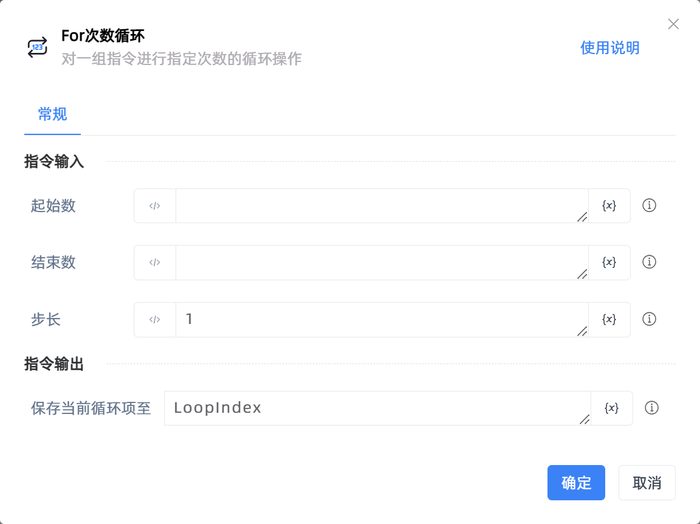
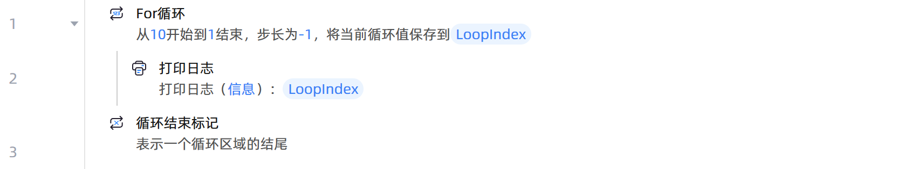

# For次数循环
- 适用系统: windows / 信创

## 功能说明

:::tip 功能描述
对一组指令进行指定次数的循环操作
:::

## 指令输入

- **起始数**`Integer`: 
    - 设置循环计数器的起始数值

 

- **结束数**`Integer`: 
    - 设置循环计数器的终点数值

 

- **步长**`Integer`: 
    - 设置每次循环后的增量值。步长为非0整数，为正数时，要求起始数小于结束数；为负数时，要求起始数大于结束数

## 指令输出

- **保存当前循环项至**`Integer`: 
    - 输入一个名称作为保存当前循环数值的变量，从起始数值开始，此变量的值将随每次循环的递增而改变

## 使用示例

**流程逻辑描述：** 使用【For循环】设置起始数为10、结束数为1、步长为-1 --> 循环体执行【打印日志】指令打印当前循环值 --> 直至当前循环值跳出循环的定义范围，则循环结束

