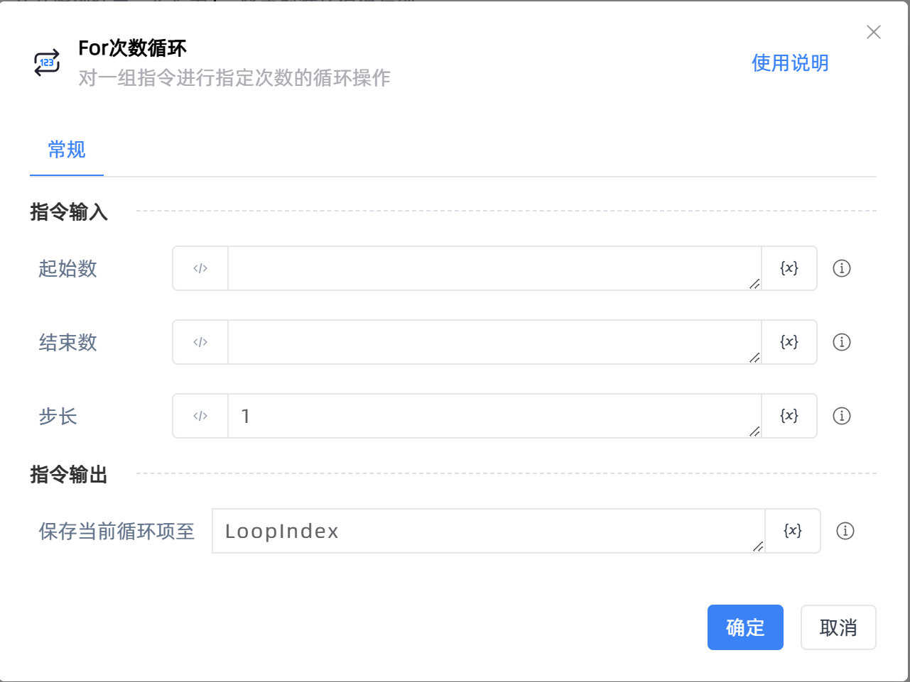

# For次数循环

## 功能说明

:::tip 功能描述
对一组指令进行指定次数的循环操作
:::

## 配置项说明

### 常规

**指令输入**

- **起始数**`Integer`: 设置循环计数器的起始数值
- **结束数**`Integer`: 设置循环计数器的终点数值

- **步长**`Integer`: 设置每次循环后的增量值，步长可为负数。

**指令输出**

- **保存当前循环项至**`Integer`: 输入一个名称作为保存当前循环数值的变量，从起始数值开始，此变量的值将随每次循环的递增而改变

## 使用示例

**流程逻辑描述：**使用【For次数循环】设置起始数为5、结束数为1、递增值为-1 --> 循环体执行【打印日志】指令打印当前循环值 --> 直至当前循环值跳出循环的定义范围，则循环结束

## 常见错误及处理

无

## 常见问题解答

无

