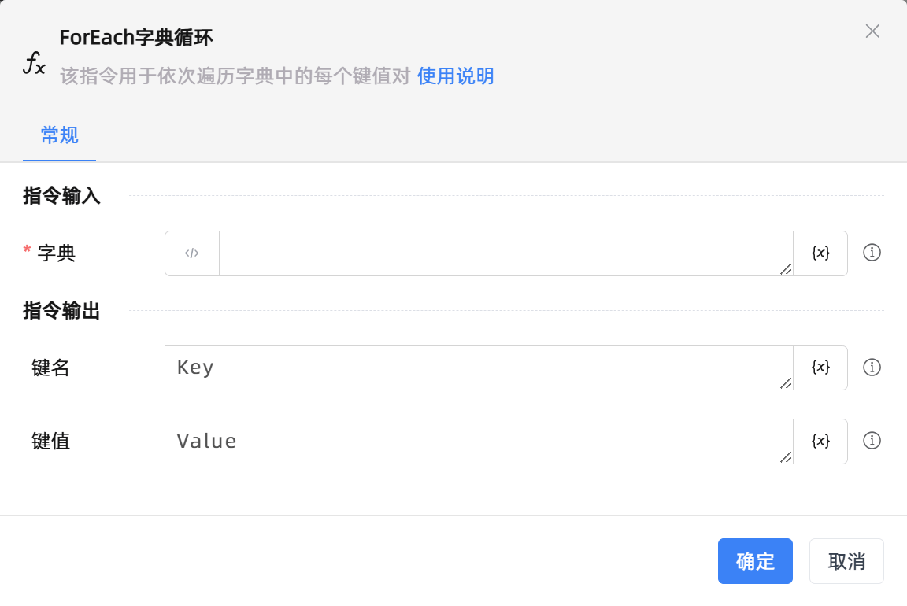
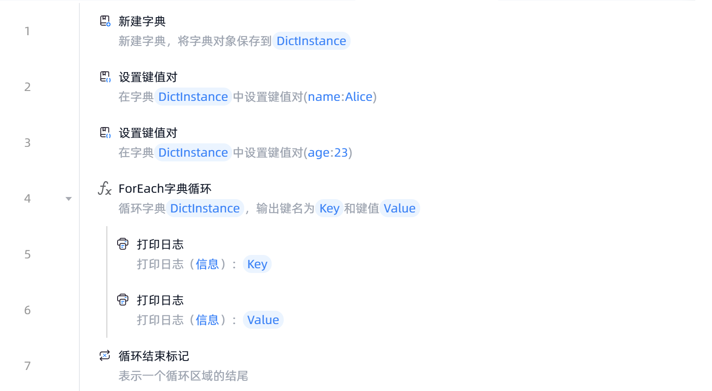

# ForEach字典循环

## 功能说明

:::tip 功能描述
该指令用于依次循环字典中的每一对键值对
:::

## 指令输入

- **字典**`TRPADictionary`: 
    - 可通过选择已创建的字典变量
    - 可在Python输入模式下输入标准的字典，如：`{"name":"RpaLite","location":"中国珠海"}`

## 指令输出

- **键名**`string`: 
    - 指定一个变量名称，用于保存当前循环的键名

 

- **键值**`string`: 
    - 指定一个变量名称，用于保存当前循环的键值

## 使用示例

**流程逻辑描述：** 使用【新建字典】创建一个空字典 --> 使用【设置键值对】往空字典增加键值对 --> 使用【ForEach字典循环】指令循环指定字典中的每一项 --> 循环体执行【打印日志】指令打印当前循环项键名以及当前循环项键值 --> 直至字典的最后一项则循环结束
