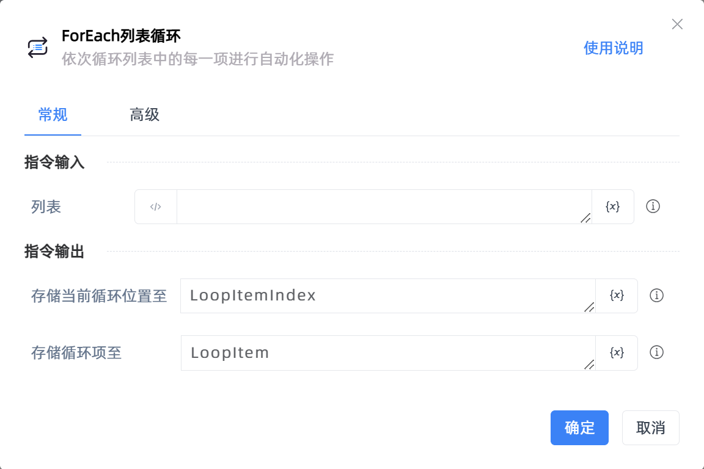

# ForEach列表循环

## 功能说明

:::tip 功能描述
依次循环列表中的每一项进行自动化操作
:::

## 配置项说明

### 常规

**指令输入**

- **列表**`TObject`: 输入一个列表

**指令输出**

- **存储当前循环位置至**`Integer`: 指定一个变量名称，用于存储当前循环项的位置

- **存储循环项至**`Variant`: 指定一个变量名称，保存当前的循环项

### 高级

- **循环开始位置**`Integer`: 循环开始位置，0标识第一项

- **循环结束位置**`Integer`: 循环结束位置，-1表示倒数第一项，结果包含结束位置的项

### 错误处理

- **打印错误日志**`Boolean`：当指令运行出错时，打印错误日志到【日志】面板。默认勾选。

- **处理方式**`Integer`：

 - **终止流程**：指令运行出错时，终止流程。

 - **忽略异常并继续执行**：指令运行出错时，忽略异常，继续执行流程。

 - **重试此指令**：指令运行出错时，重试运行指定次数指令，每次重试间隔指定时长。

## 使用示例

**流程逻辑描述：** 

## 常见错误及处理

无

## 常见问题解答

无

