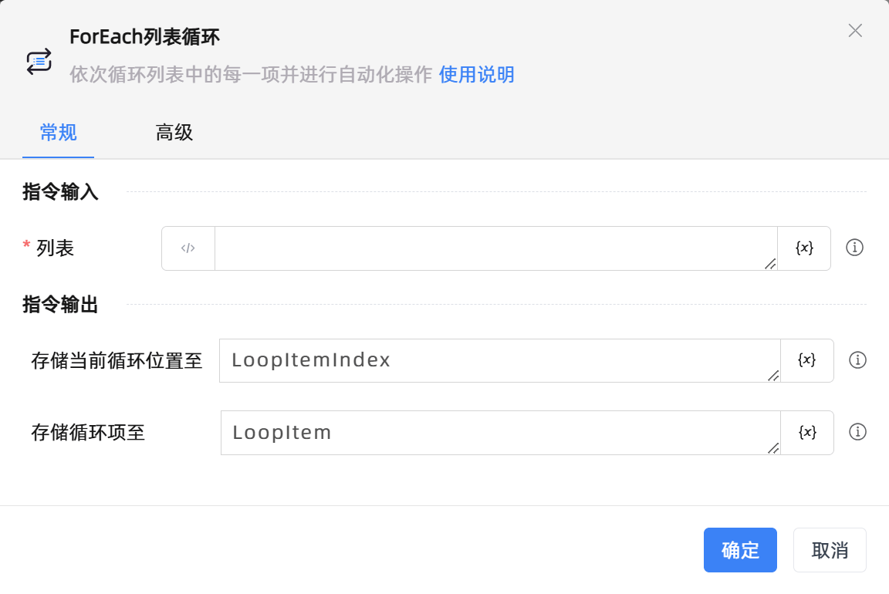
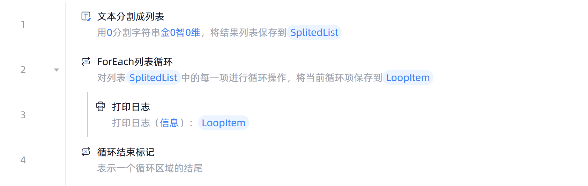

# ForEach列表循环

## 功能说明

:::tip 功能描述
依次循环列表中的每一项进行自动化操作
:::

## 配置项说明

### 常规

**指令输入**

- **列表**`TObject`: 输入一个列表

**指令输出**

- **存储当前循环位置至**`Integer`: 指定一个变量名称，用于存储当前循环项的位置

- **存储循环项至**`Variant`: 指定一个变量名称，保存当前的循环项

### 高级

- **循环开始位置**`Integer`: 循环开始位置，0标识第一项

- **循环结束位置**`Integer`: 循环结束位置，-1表示倒数第一项，结果包含结束位置的项

## 使用示例

**流程逻辑描述：** 使用【文本分割成列表】将字符串分割成列表 --> 使用【ForEach列表循环】指令循环指定列表中的每一项 --> 循环体执行【打印日志】指令打印当前循环项 --> 直至列表的最后一项则循环结束

## 常见错误及处理

无

## 常见问题解答

无

