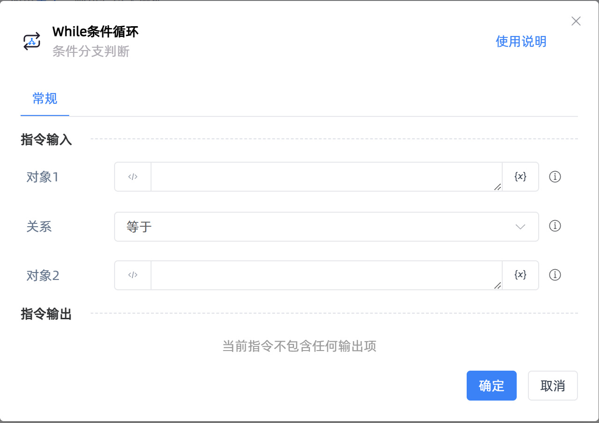
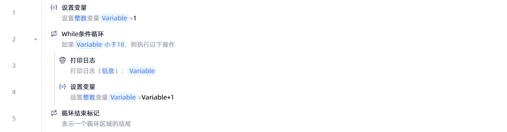

# While条件循环

## 功能说明

:::tip 功能描述
当条件为真时,对一组指令进行循环操作
:::

## 配置项说明

### 常规

**指令输入**

- **对象1**`string`: 输入前面指令创建的变量、文本或者数字，与对象2进行对比。内容的输入方式有：
  - 在默认的文本模式下直接输入文本
  - 在编程模式下输入表达式
  - 通过`{x}`选择已创建的变量

- **关系**`Integer`: 选择对象1和对象2的比较方式，如："对象1等于对象2"、"对象1包含对象2"、"对象1以对象2开头"等方式

- **对象2**`string`: 内容的输入方式与对象1相同，当判断条件只需要一个对象时，对象2可缺省，如："对象1等于True"、"对象1是空值"等方式

- **忽略大小写**`Boolean`: 若勾选，表示在比较时忽略大小写

- **空白符**`Boolean`: 若勾选，则空字符串、空格、换行符、制表符、换页符等均视为空值；否则仅将空字符串视为空值

**指令输出**

当前指令无输出

## 使用示例

**流程逻辑描述：** 设置整数变量值为1 --> 使用【While条件循环】指令判断条件是否成立 --> 若成立则执行【打印日志】指令打印当前变量值并设置变量值增加1 --> 直至条件不成立则循环结束

## 常见错误及处理

无

## 常见问题解答

无

