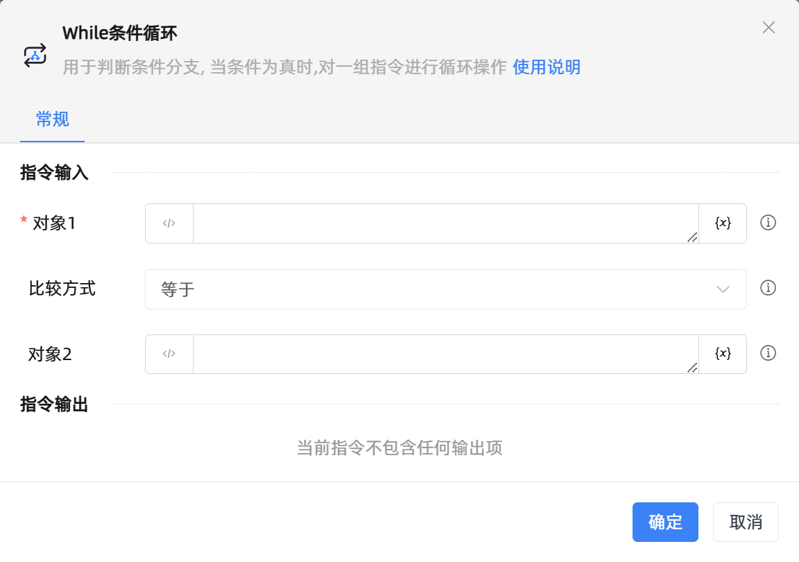

# While条件循环

## 功能说明

:::tip 功能描述
条件分支判断, 当条件为真时,对一组指令进行循环操作
:::

## 配置项说明

### 常规

**指令输入**

- **对象1**`string`: 输入前面指令创建的变量、文本或者数字，与对象2进行对比

- **关系**`Integer`: 选择对象1和对象2的比较方式

- **对象2**`string`: 输入前面指令创建的变量、文本或者数字，与对象1进行对比

- **空白符**`Boolean`: 包含空字符串、空格、换行符、制表符、换页符等

- **忽略大小写**`Boolean`: 若勾选，表示在比较时忽略大小写

**指令输出**

当前指令无输出

## 使用示例

**流程逻辑描述：** 

## 常见错误及处理

无

## 常见问题解答

无

