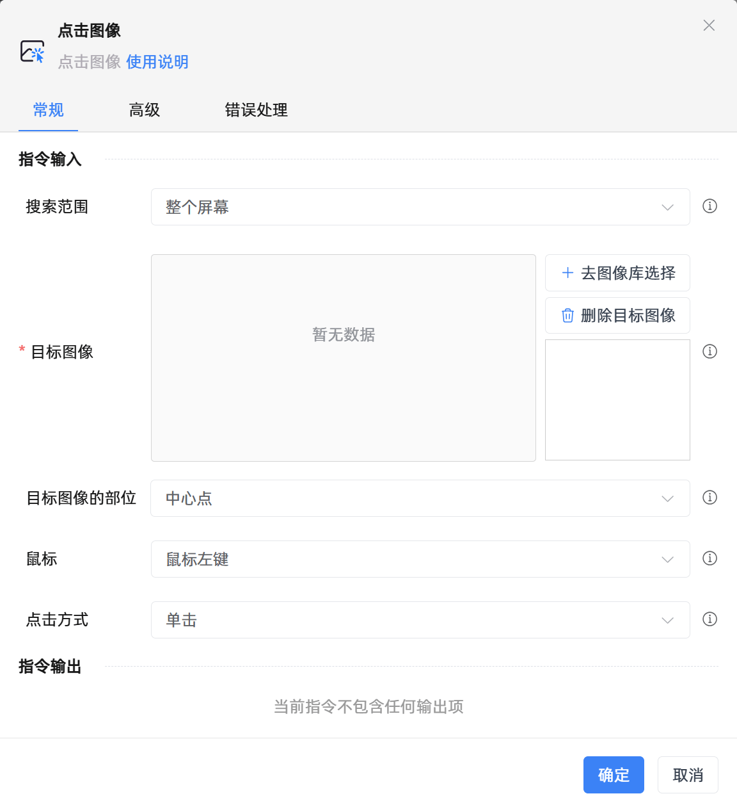

# 点击图像

## 功能说明

:::tip 功能描述
点击图像
:::

## 配置项说明

### 常规

**指令输入**

- **搜索范围**`Integer`: 请明确搜索的范围

- **窗口对象**`TWinObj`: 请选择一个窗口对象

- **目标图像**`string`: 可以选择多幅图像，按顺序查找，直到在超时时间内找到任意一幅匹配的图像并点击

- **目标图像的部位**`Integer`: 请选择需要点击目标图像的哪个部位

- **自定义**`Integer`: 自定义位置

- **横向移动**`Integer`: 如果输入的是正数，则会向右移动，如果输入的是负数，则会向左移动

- **纵向移动**`Integer`: 如果输入的是正数，则会向下移动，如果输入的是负数，则会向上移动

- **鼠标**`Integer`: 选择用于触发点击的鼠标按键

- **点击方式**`Integer`: 选择单击或双击

**指令输出**

当前指令无输出

### 高级

- **键盘辅助按钮**`Integer`: 需要按下的键盘功能键

- **显示鼠标移动轨迹**`Boolean`: 是否需要显示鼠标的移动轨迹

- **超时的时间(毫秒)**`Integer`: 设置最长的等待时间

- **执行前的延迟(毫秒)**`Integer`: 指令执行前的等待时间

- **执行后的延迟(毫秒)**`Integer`: 指令执行完成后的继续等待时间

### 错误处理

- **打印错误日志**`Boolean`：当指令运行出错时，打印错误日志到【日志】面板。默认勾选。

- **处理方式**`Integer`：

 - **终止流程**：指令运行出错时，终止流程。

 - **忽略异常并继续执行**：指令运行出错时，忽略异常，继续执行流程。

 - **重试此指令**：指令运行出错时，重试运行指定次数指令，每次重试间隔指定时长。

## 使用示例

**流程逻辑描述：** 

## 常见错误及处理

无

## 常见问题解答

无

