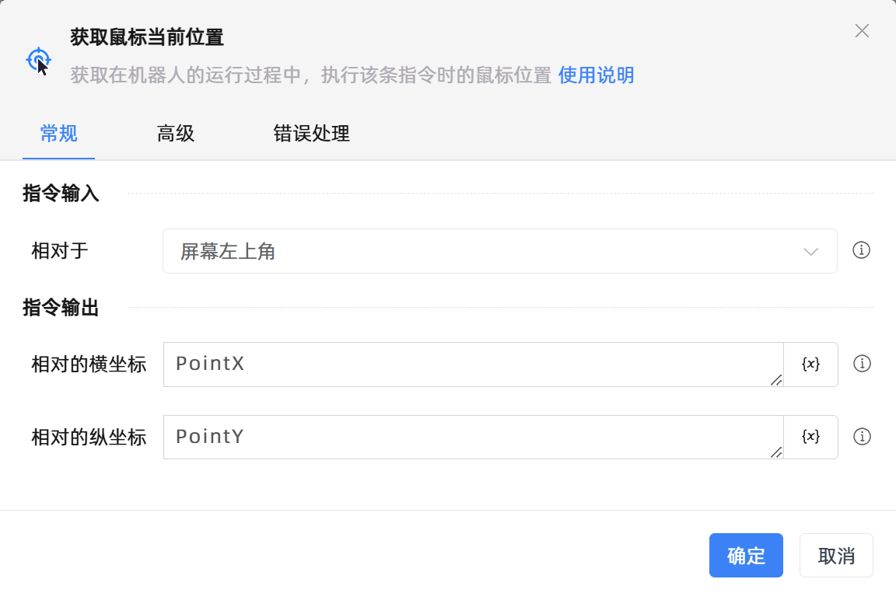

# 获取鼠标当前位置

## 功能说明

:::tip 功能描述
获取在机器人的运行过程中，执行该条指令时的鼠标位置
:::

## 配置项说明

### 常规

**指令输入**

- **相对于**`Integer`: 鼠标的位置

**指令输出**

- **相对的横坐标**`Integer`: 指定一个变量，用来保存当前鼠标位置的横坐标

- **相对的纵坐标**`Integer`: 指定一个变量，用来保存当前鼠标位置的纵坐标

### 高级

- **执行前的延迟(毫秒)**`Integer`: 指令执行前的等待时间

### 错误处理

- **打印错误日志**`Boolean`：当指令运行出错时，打印错误日志到【日志】面板。默认勾选。

- **处理方式**`Integer`：

 - **终止流程**：指令运行出错时，终止流程。

 - **忽略异常并继续执行**：指令运行出错时，忽略异常，继续执行流程。

 - **重试此指令**：指令运行出错时，重试运行指定次数指令，每次重试间隔指定时长。

## 使用示例

**流程逻辑描述：** 

## 常见错误及处理

无

## 常见问题解答

无

