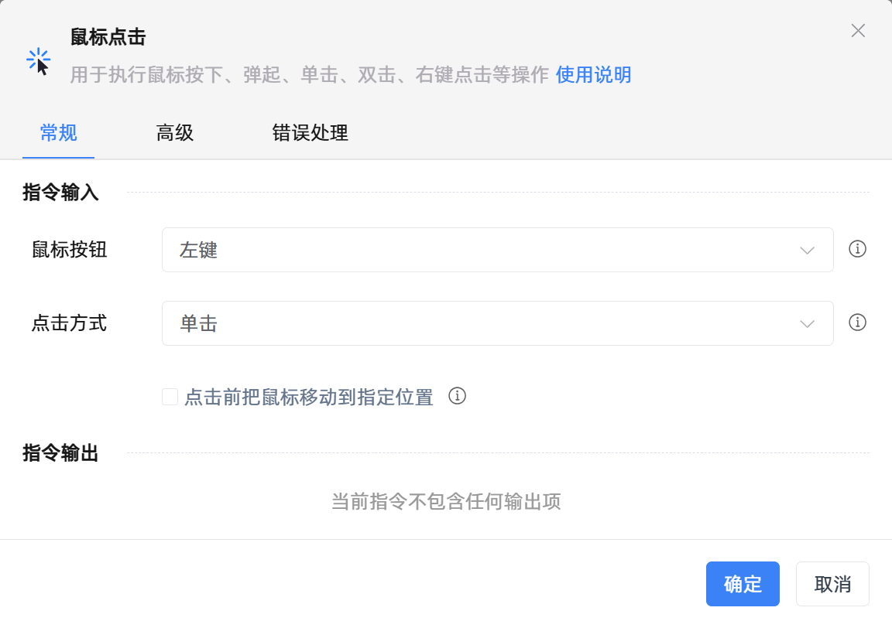

# 鼠标点击
- 适用系统: windows / 信创

## 功能说明

:::tip 功能描述
用于执行鼠标按下、弹起、单击、双击、右键点击等操作
:::

## 配置项说明

### 常规

**指令输入**

- **鼠标按钮**`Integer`: 选择使用哪个按钮进行点击

- **点击方式**`Integer`: 单击或者双击

- **点击前把鼠标移动到指定位置**`Boolean`: 点击前先把鼠标移动到指定位置

- **相对于**`Integer`: 鼠标的位置

- **移动鼠标至 X**`Integer`: 相对的横坐标

- **移动鼠标至 Y**`Integer`: 相对的纵坐标

- **移速**`Integer`: 指定鼠标移动的速度

**指令输出**

当前指令无输出

### 高级

- **键盘辅助按钮**`Integer`: 请选择需要按下的键盘功能键

- **执行前的延迟(毫秒)**`Integer`: 指令执行前的等待时间

- **执行后的延迟(毫秒)**`Integer`: 指令执行完成后的继续等待时间

### 错误处理

- **打印错误日志**`Boolean`：当指令运行出错时，打印错误日志到【日志】面板。默认勾选。

- **处理方式**`Integer`：

 - **终止流程**：指令运行出错时，终止流程。

 - **忽略异常并继续执行**：指令运行出错时，忽略异常，继续执行流程。

 - **重试此指令**：指令运行出错时，重试运行指定次数指令，每次重试间隔指定时长。

## 使用示例
无

## 常见错误及处理

无

## 常见问题解答

无

