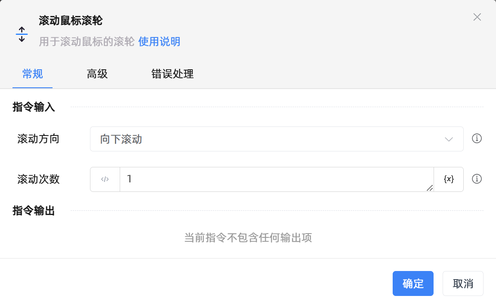

# 滚动鼠标滚轮

## 功能说明

:::tip 功能描述
用于滚动鼠标的滚轮
:::

## 配置项说明

### 常规

**指令输入**

- **滚动方向**`Integer`: 请选择向上滚动亦或是向下滚动

- **滚动次数**`Integer`: 输入滚动次数

**指令输出**

当前指令无输出

### 高级

- **键盘辅助按钮**`Integer`: 请选择需要按下的键盘功能键

- **执行前的延迟(毫秒)**`Integer`: 指令执行前的等待时间

- **执行后的延迟(毫秒)**`Integer`: 当指令执行完成后，继续等待的时间

- **滚动前把鼠标移动到指定位置**`Boolean`: 滚动前，鼠标需要移动到的指定位置

- **相对于**`Integer`: 鼠标的位置

- **移动鼠标至 X**`Integer`: 相对的横坐标

- **移动鼠标至 Y**`Integer`: 相对的纵坐标

- **移速**`Integer`: 鼠标的移动速度

### 错误处理

- **打印错误日志**`Boolean`：当指令运行出错时，打印错误日志到【日志】面板。默认勾选。

- **处理方式**`Integer`：

 - **终止流程**：指令运行出错时，终止流程。

 - **忽略异常并继续执行**：指令运行出错时，忽略异常，继续执行流程。

 - **重试此指令**：指令运行出错时，重试运行指定次数指令，每次重试间隔指定时长。

## 使用示例

**流程逻辑描述：** 

## 常见错误及处理

无

## 常见问题解答

无

