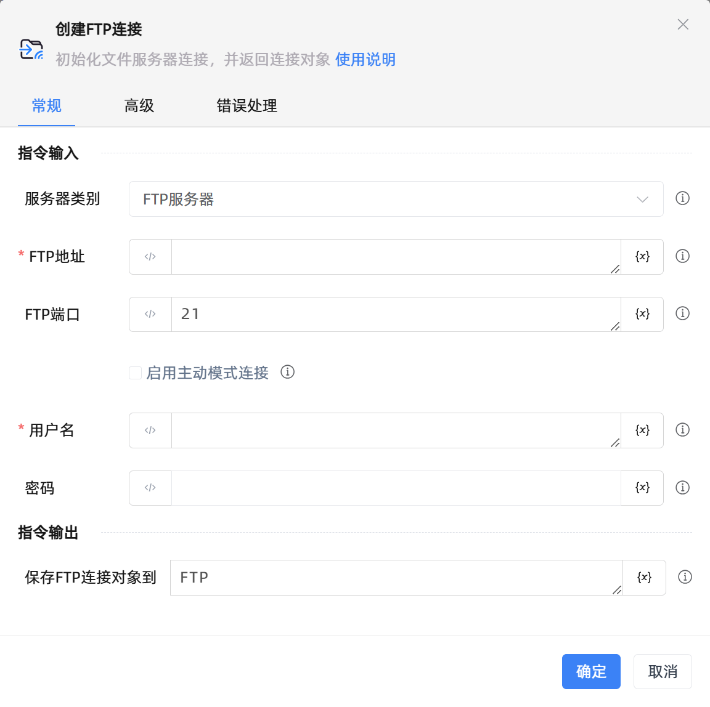

# 创建FTP连接

## 功能说明

:::tip 功能描述
初始化文件服务器连接，并返回连接对象
:::

## 配置项说明

### 常规

**指令输入**

- **服务器类别**`Integer`: 请选择要创建的连接对象的服务器类别

- **FTP地址**`string`: 请输入FTP服务器地址

- **FTP端口**`Integer`: 请输入FTP服务器端口

- **启用主动模式连接**`Boolean`: 建议使用ftp被动模式，如果FTP服务器配置仅支持主动模式或服务器网络配置不允许被动模式进行连接，此时需选择主动模式

- **FTP连接方式**`Integer`: 请选择连接远程ftp服务器的方式，默认使用密码连接

- **用户名**`string`: 请输入用于连接FTP服务器的用户名称

- **密码**`string`: 请输入用于连接FTP服务器的用户密码

- **秘钥文件**`string`: 请选择用于连接到ftp服务器的密钥文件

**指令输出**

- **保存FTP连接对象到**`TFTP`: 指定一个用于存储FTP连接对象的变量名称

### 高级

- **执行前的延迟(毫秒)**`Integer`: 指令执行前的等待时间

- **连接超时(毫秒)**`Integer`: 请输入ftp连接超时的毫秒数

### 错误处理

- **打印错误日志**`Boolean`：当指令运行出错时，打印错误日志到【日志】面板。默认勾选。

- **处理方式**`Integer`：

 - **终止流程**：指令运行出错时，终止流程。

 - **忽略异常并继续执行**：指令运行出错时，忽略异常，继续执行流程。

 - **重试此指令**：指令运行出错时，重试运行指定次数指令，每次重试间隔指定时长。

## 使用示例
无

## 常见错误及处理

无

## 常见问题解答

无

