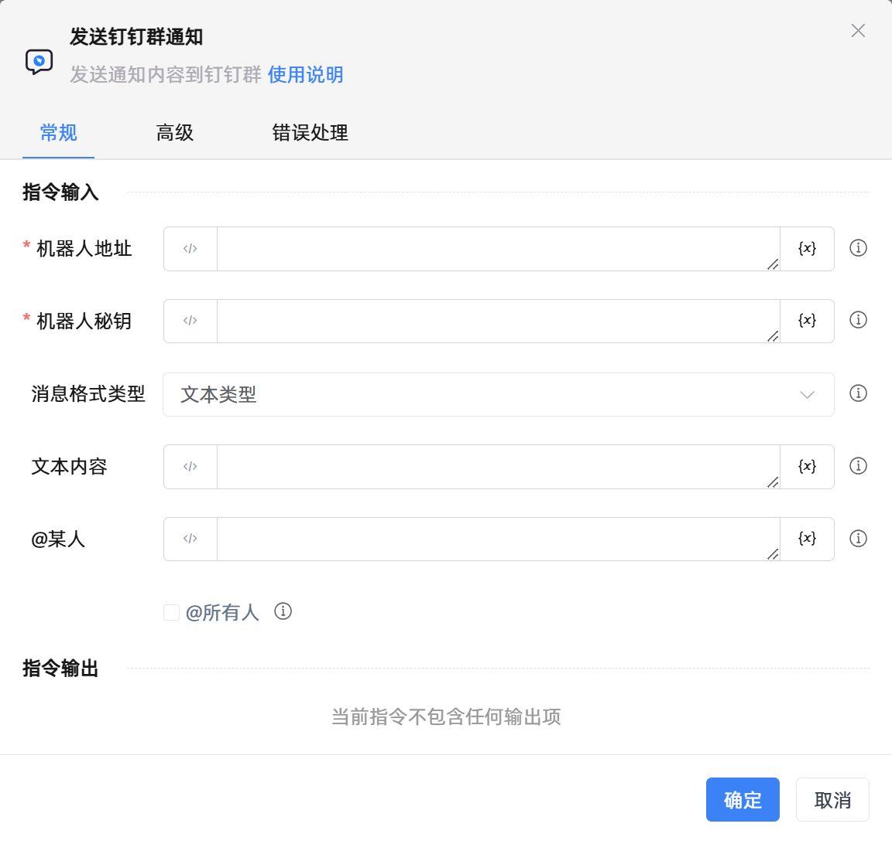

# 发送钉钉群通知

## 功能说明

:::tip 功能描述
发送通知内容到钉钉群
:::

## 配置项说明

### 常规

**指令输入**

- **机器人地址**`string`: 请输入机器人的网络地址，即WebHook，需要自行申请

- **机器人秘钥**`string`: 请输入在机器人安全设置页面，加签一栏下面显示的SEC开头的字符串

- **消息格式类型**`Integer`: 请选择消息类型及数据格式

- **文本内容**`string`: 请输入群通知的文本内容

- **MarkDown文本内容**`string`: 请输入群通知的MarkDown文本内容

- **@某人**`String`: 请输入需要@成员所绑定的手机号，多成员切换编程模式请输入手机号列表，如['手机号1','手机号2']

- **@所有人**`Boolean`: 勾选@所有人后，@某人将不起作用

**指令输出**

当前指令无输出

### 高级

- **执行前的延迟(毫秒)**`Integer`: 指令执行前的等待时间

### 错误处理

- **打印错误日志**`Boolean`：当指令运行出错时，打印错误日志到【日志】面板。默认勾选。

- **处理方式**`Integer`：

 - **终止流程**：指令运行出错时，终止流程。

 - **忽略异常并继续执行**：指令运行出错时，忽略异常，继续执行流程。

 - **重试此指令**：指令运行出错时，重试运行指定次数指令，每次重试间隔指定时长。

## 使用示例

**流程逻辑描述：** 

## 常见错误及处理

无

## 常见问题解答

无

