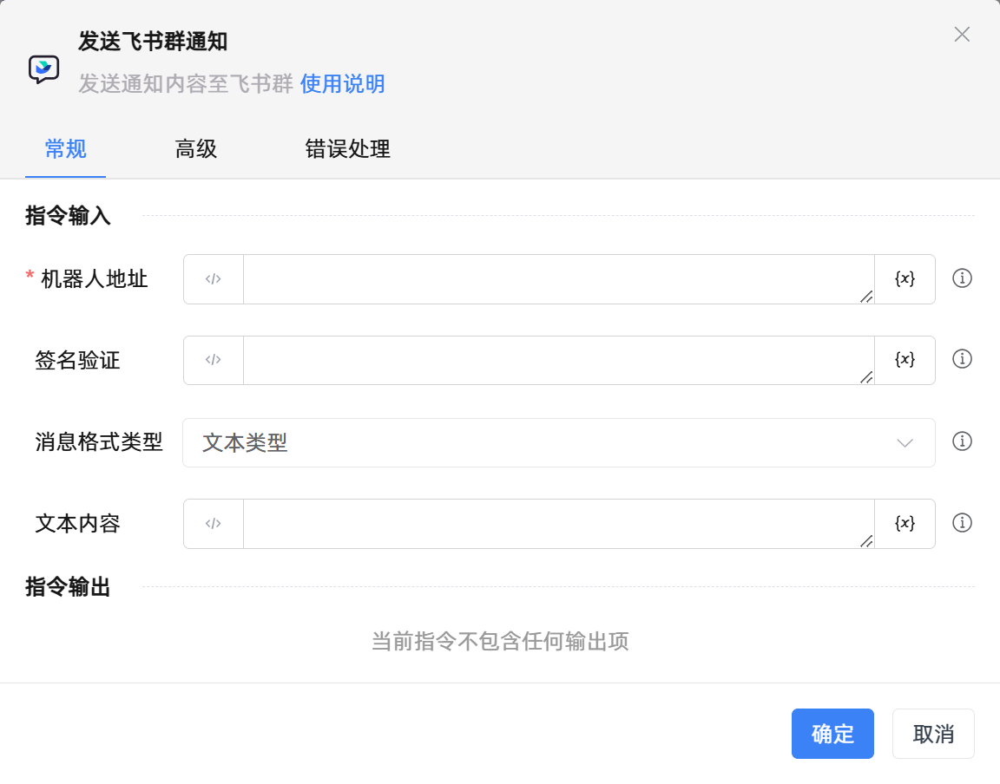

# 发送飞书群通知

## 功能说明

:::tip 功能描述
发送通知内容至飞书群
:::

## 配置项说明

### 常规

**指令输入**

- **机器人地址**`string`: 请输入机器人的网络地址，即WebHook，需要自行申请

- **签名验证**`string`: 请输入机器人安全设置中的签名验证，如果没设置签名验证则不需要输入

- **消息格式类型**`Integer`: 请选择消息类型及数据格式

- **app_id**`string`: 请输入app_id，用于获取tenant_access_token，在富文本消息和消息卡片中使用

- **app_secret**`string`: 请输入app_secret，用于获取tenant_access_token，在富文本消息和消息卡片中使用

- **文本内容**`string`: 请输入群通知的文本内容

- **富文本内容**`string`: 支持使用飞书原格式内容，可参考飞书消息说明，若需使用电话号码或者邮箱进行@操作，可以根据该电话号码和邮箱获取到对应的user_id

- **消息卡片内容**`string`: 飞书独有的消息卡片格式，可使用飞书官方提供的飞书消息卡片搭建工具进行编辑消息卡片

- **图片地址**`string`: 请输入图片地址，图片最大不能超过10M，支持JPG，PNG格式

**指令输出**

当前指令无输出

### 高级

- **执行前的延迟(毫秒)**`Integer`: 指令执行前的等待时间

### 错误处理

- **打印错误日志**`Boolean`：当指令运行出错时，打印错误日志到【日志】面板。默认勾选。

- **处理方式**`Integer`：

 - **终止流程**：指令运行出错时，终止流程。

 - **忽略异常并继续执行**：指令运行出错时，忽略异常，继续执行流程。

 - **重试此指令**：指令运行出错时，重试运行指定次数指令，每次重试间隔指定时长。

## 使用示例
无

## 常见错误及处理

无

## 常见问题解答

无

