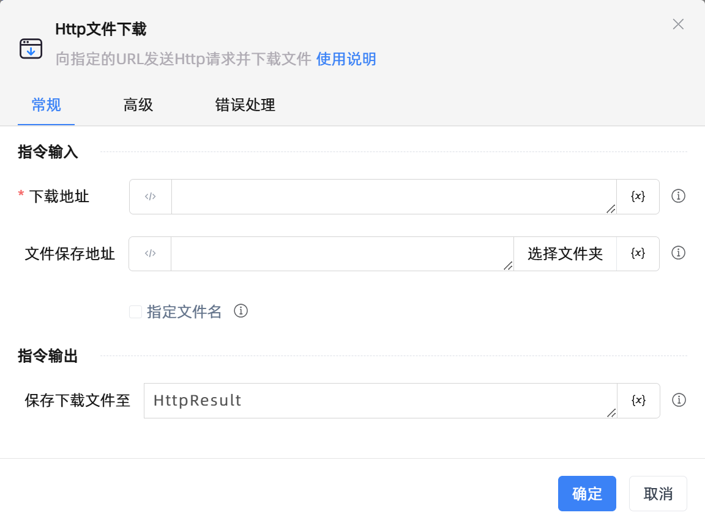

# Http文件下载
- 适用系统: windows / 信创

## 功能说明

:::tip 功能描述
向指定的URL发送Http请求并下载文件
:::

## 配置项说明

### 常规

**指令输入**

- **下载地址**`string`: 请输入http文件下载的请求地址

- **文件保存地址**`string`: 请输入或选择文件保存的地址

- **指定文件名**`Boolean`: 勾选后可指定保存到文件夹的文件名称

- **文件名称**`string`: 请输入要保存至文件夹的文件名称

**指令输出**

- **保存下载文件至**`string`: 指定一个用于存储保存下载文件名称（包括路径）的变量名称

### 高级

- **连接超时(毫秒)**`Integer`: 请输入http连接超时的毫秒数

- **执行前的延迟(毫秒)**`Integer`: 指令执行前的等待时间

### 错误处理

- **打印错误日志**`Boolean`：当指令运行出错时，打印错误日志到【日志】面板。默认勾选。

- **处理方式**`Integer`：

 - **终止流程**：指令运行出错时，终止流程。

 - **忽略异常并继续执行**：指令运行出错时，忽略异常，继续执行流程。

 - **重试此指令**：指令运行出错时，重试运行指定次数指令，每次重试间隔指定时长。

## 使用示例
无

## 常见错误及处理

无

## 常见问题解答

无

