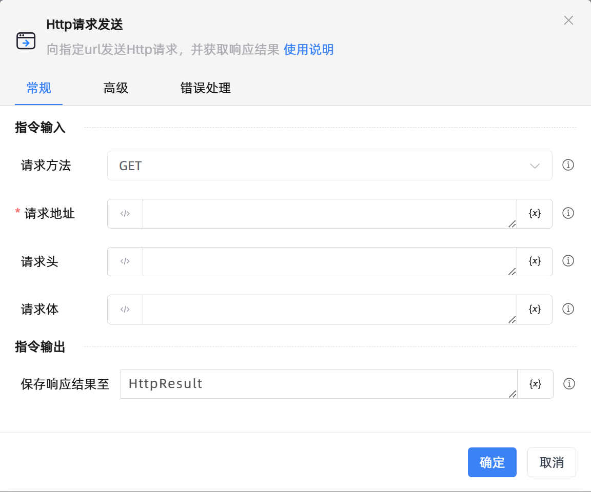

# Http请求发送

## 功能说明

:::tip 功能描述
向指定url发送Http请求，并获取响应结果
:::

## 配置项说明

### 常规

**指令输入**

- **请求方法**`Integer`: 请选择请求方法

- **请求地址**`string`: 请输入要请求的URL地址

- **请求头**`string`: 请输入请求头内容，多行可使用逗号分割，每行格式为“请求头名称:请求头内容”

- **请求体**`string`: 请输入待发送到服务器的请求体内容

**指令输出**

- **保存响应结果至**`TList<String>`: 指定一个用于存放响应结果的变量名称

### 高级

- **执行前的延迟(毫秒)**`Integer`: 指令执行前的等待时间

- **连接超时(毫秒)**`Integer`: 请输入http连接超时的毫秒数

- **结果存文件**`Boolean`: 勾选后将响应结果保存为文件

- **文件保存路径**`string`: 请输入或选择文件保存的路径

- **文件名称**`string`: 请输入要保存至文件夹的文件名称

### 错误处理

- **打印错误日志**`Boolean`：当指令运行出错时，打印错误日志到【日志】面板。默认勾选。

- **处理方式**`Integer`：

 - **终止流程**：指令运行出错时，终止流程。

 - **忽略异常并继续执行**：指令运行出错时，忽略异常，继续执行流程。

 - **重试此指令**：指令运行出错时，重试运行指定次数指令，每次重试间隔指定时长。

## 使用示例

**流程逻辑描述：** 

## 常见错误及处理

无

## 常见问题解答

无

