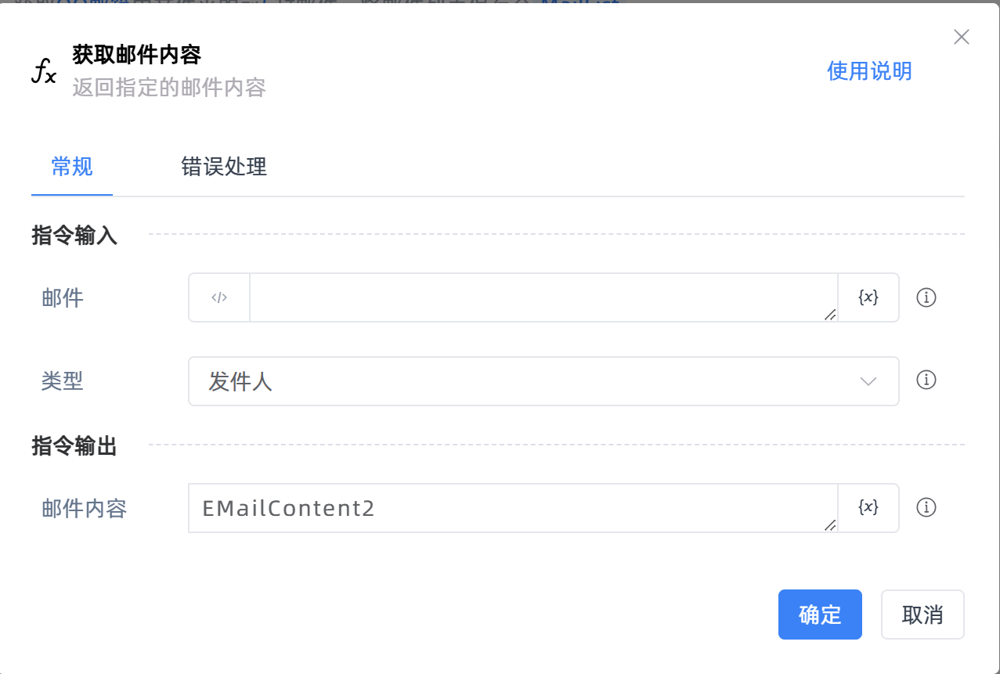
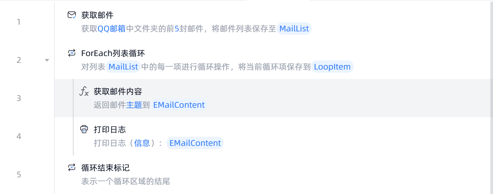

# 获取邮件内容

## 功能说明

:::tip 功能描述
获取指定的邮件内容
:::

## 配置项说明

### 常规

**指令输入**

- **邮件**`TMailMessage`: 输入【获取邮件】指令获取到的邮件对象
- **类型**`Integer`: 选择要获取的邮件内容，包括发件人、收件人、主题、正文、HTML正文等

**指令输出**

- **邮件内容**`string`: 指定一个变量名称，该变量用于存储获取到的邮件内容

### 错误处理

- **打印错误日志**`Boolean`：当指令运行出错时，打印错误日志到【日志】面板。默认勾选。

- **处理方式**`Integer`：

 - **终止流程**：指令运行出错时，终止流程。

 - **忽略异常并继续执行**：指令运行出错时，忽略异常，继续执行流程。

 - **重试此指令**：指令运行出错时，重试运行指定次数指令，每次重试间隔指定时长。

## 使用示例

**流程逻辑描述：**使用【获取邮件】指令获取QQ邮箱的前5封邮件-->使用【ForEach列表循环】指令遍历获取到的邮件对象列表-->对每封邮件，使用【获取邮件内容】指令获取邮件主题-->使用【打印日志】指令将邮件主题打印输出

## 常见错误及处理

无

## 常见问题解答

无

