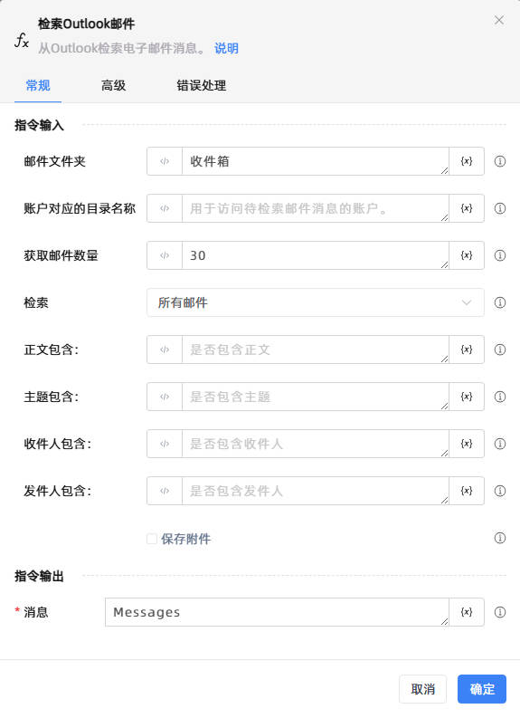

# 检索 Outlook 邮件
- 适用系统: windows / 信创

## 功能说明

:::tip 功能描述
从Outlook检索电子邮件消息。
:::

## 配置项说明

### 常规

**指令输入**

- **邮件文件夹**: 默认是'收件箱'，多级目录使用英文逗号分隔

- **账户对应的目录名称**: 用于访问待检索邮件消息的账户。

- **获取邮件数量**: 从列表顶部开始检索的消息数量。

- **检索**: 检索的邮件类型。

- **正文包含**: 正文是否包含对应的关键词。

- **主题包含**: 主题是否包含对应的关键词。

- **收件人包含**: 收件人是否包含对应的关键词。

- **发件人包含**: 发件人是否包含对应的关键词。

- **保存附件**: 勾选后将保存邮件附件

- **附件保存目录**: 请输入或选择附件保存的路径

**指令输出**

- **消息**: 作为邮件消息对象集合的已检索邮件消息。

### 高级

- **获取方式**: 按收件日期进行获取。从最早开始：按时间由远到近（从最旧到最新）获取N条记录；即优先返回时间戳最小的最早数据。从最新开始：按时间由近到远（从最新到最旧）获取N条记录；即优先返回时间戳最大的最新数据。

- **标记为已读**: 指定是否将检索到的邮件标记为已读。默认情况下，清除此复选框。

- **自动同步邮件**: 获取时是否自动同步最新的邮件。

## 使用示例
无

## 常见错误及处理

无

## 常见问题解答

无

