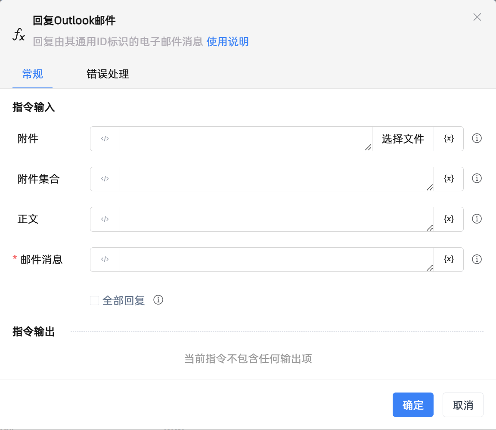

# 回复Outlook邮件

## 功能说明

:::tip 功能描述
回复由其通用ID标识的电子邮件消息
:::

## 配置项说明

### 常规

**指令输入**

- **附件**`string`: 可以发送多个附件，使用;分割

- **附件集合**`TList<string>`: 允许指定待附加的一组文件

- **正文**`string`: 电子邮件消息正文。

- **邮件消息**`TMailMessage`: 待回复的邮件消息对象。

- **全部回复**`Boolean`: 如果不选中，则电子邮件将只回复给发件人。如果选中，则电子邮件将回复给发件人以及'收件人'和'抄送'字段中的所有其他收件人

**指令输出**

当前指令无输出

### 错误处理

- **打印错误日志**`Boolean`：当指令运行出错时，打印错误日志到【日志】面板。默认勾选。

- **处理方式**`Integer`：

 - **终止流程**：指令运行出错时，终止流程。

 - **忽略异常并继续执行**：指令运行出错时，忽略异常，继续执行流程。

 - **重试此指令**：指令运行出错时，重试运行指定次数指令，每次重试间隔指定时长。

## 使用示例

**流程逻辑描述：** 

## 常见错误及处理

无

## 常见问题解答

无

