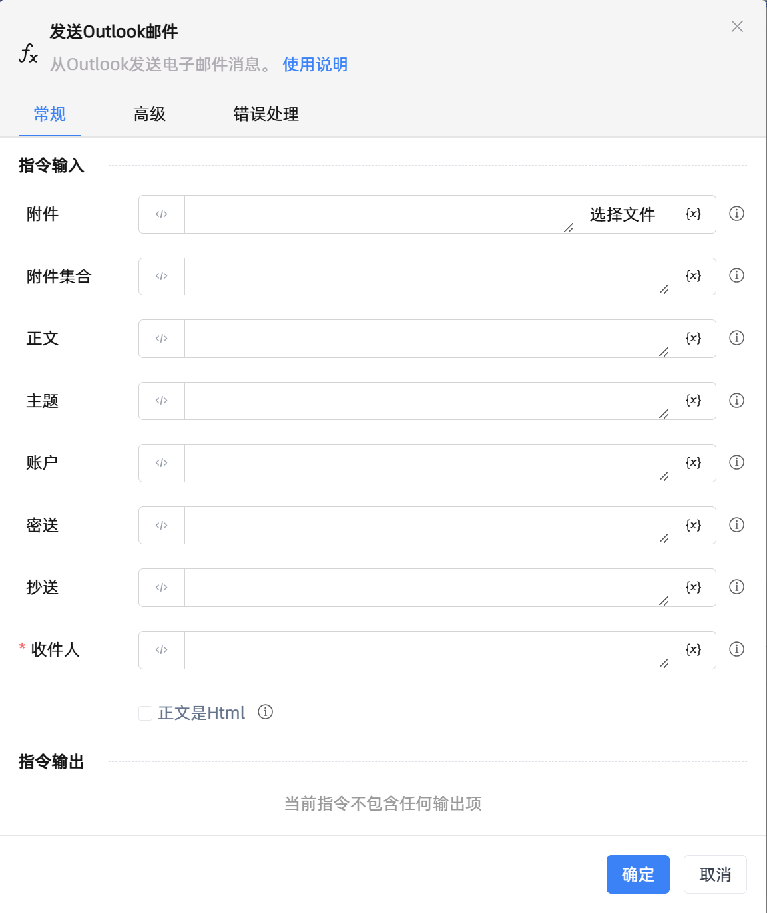

# 发送Outlook邮件

## 功能说明

:::tip 功能描述
从Outlook发送电子邮件消息。
:::

## 配置项说明

### 常规

**指令输入**

- **附件**`string`: 可以发送多个附件，使用;分割

- **附件集合**`TList<string>`: 允许指定待附加的一组文件

- **正文**`string`: 电子邮件消息正文。

- **主题**`string`: 电子邮件消息的主题。

- **账户**`string`: 用于发送邮件消息的帐户。

- **密送**`string`: 隐藏的电子邮件消息收件人。

- **抄送**`string`: 次要电子邮件消息收件人。

- **收件人**`string`: 主要的电子邮件消息收件人。

- **正文是Html**`Boolean`: 指定消息主体是否以HTML格式编写。

**指令输出**

当前指令无输出

### 高级

- **邮件消息**`TMailMessage`: 要转发的邮件消息。该字段仅支持邮件消息对象。

- **代表某人发送**`string`: 指明邮件消息预期发件人的显示名称。

- **是草稿**`Boolean`: 指定是否将邮件另存为草稿。

### 错误处理

- **打印错误日志**`Boolean`：当指令运行出错时，打印错误日志到【日志】面板。默认勾选。

- **处理方式**`Integer`：

 - **终止流程**：指令运行出错时，终止流程。

 - **忽略异常并继续执行**：指令运行出错时，忽略异常，继续执行流程。

 - **重试此指令**：指令运行出错时，重试运行指定次数指令，每次重试间隔指定时长。

## 使用示例
无

## 常见错误及处理

无

## 常见问题解答

无

