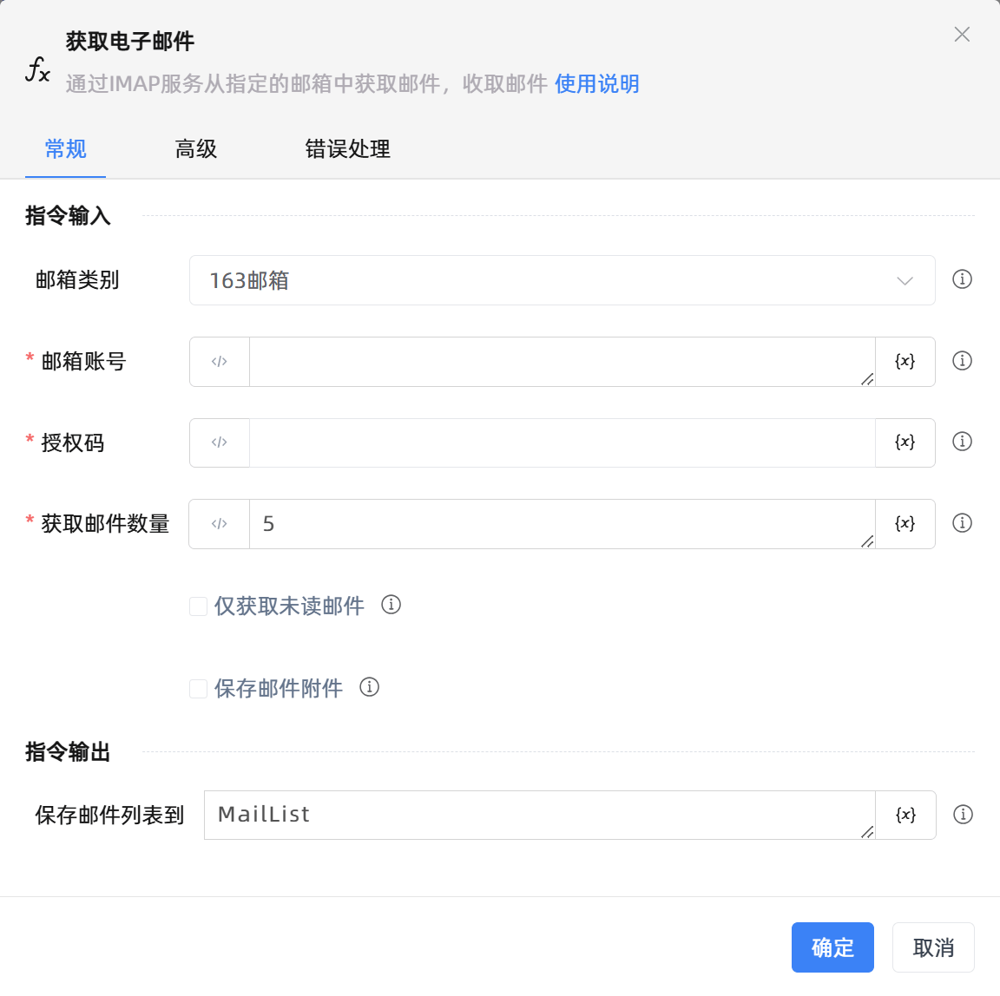

# 获取电子邮件

## 功能说明

:::tip 功能描述
通过IMAP服务从指定的邮箱中获取邮件，收取邮件
:::

## 配置项说明

### 常规

**指令输入**

- **邮箱类别**`Integer`: 请选择邮箱类别，可使用不同邮箱类型获取电子邮件消息

- **IMAP服务器**`string`: 请输入指定的IMAP服务器地址

- **IMAP端口**`Integer`: 请输入指定的IMAP服务器端口号

- **启用SSL获取**`Boolean`: 勾选后将使用SSL获取邮件

- **SSL协议**`Integer`: 可选择不同安全套字接协议来进行获取邮件

- **邮箱账号**`string`: 请输入IMAP服务器进行身份验证的用户，通常是邮箱账号

- **授权码**`string`: 请输入IMAP服务器身份验证所需的授权码，通常需通过短信验证来启用，部分邮箱服务使用账号密码进行验证。以具体邮件服务商的规定为准

- **获取邮件数量**`Integer`: 请输入获取邮箱的前N封邮件

- **仅获取未读邮件**`Boolean`: 勾选后将获取所有未读的邮件

- **保存邮件附件**`Boolean`: 勾选后将保存邮件附件

- **附件保存目录**`string`: 请输入或选择附件保存的路径

**指令输出**

- **保存邮件列表到**`TList<TMailMessage>`: 指定一个用于存放获取到的邮件列表的变量名称

### 高级

- **文件夹名称**`string`: 请输入邮箱文件夹名称

- **邮箱标记为已读**`Boolean`: 勾选后，获取到的邮件将标记已读状态

- **发件人中包含的内容**`string`: 请输入发件人中包含的内容

- **收件人中包含的内容**`string`: 请输入收件人中包含的内容

- **邮件主题包含的内容**`string`: 请输入邮件主题包含的内容

- **正文中包含的内容**`string`: 请输入邮件正文中包含的内容

- **执行前的延迟(毫秒)**`Integer`: 指令执行前的等待时间

### 错误处理

- **打印错误日志**`Boolean`：当指令运行出错时，打印错误日志到【日志】面板。默认勾选。

- **处理方式**`Integer`：

 - **终止流程**：指令运行出错时，终止流程。

 - **忽略异常并继续执行**：指令运行出错时，忽略异常，继续执行流程。

 - **重试此指令**：指令运行出错时，重试运行指定次数指令，每次重试间隔指定时长。

## 使用示例

**流程逻辑描述：** 

## 常见错误及处理

无

## 常见问题解答

无

