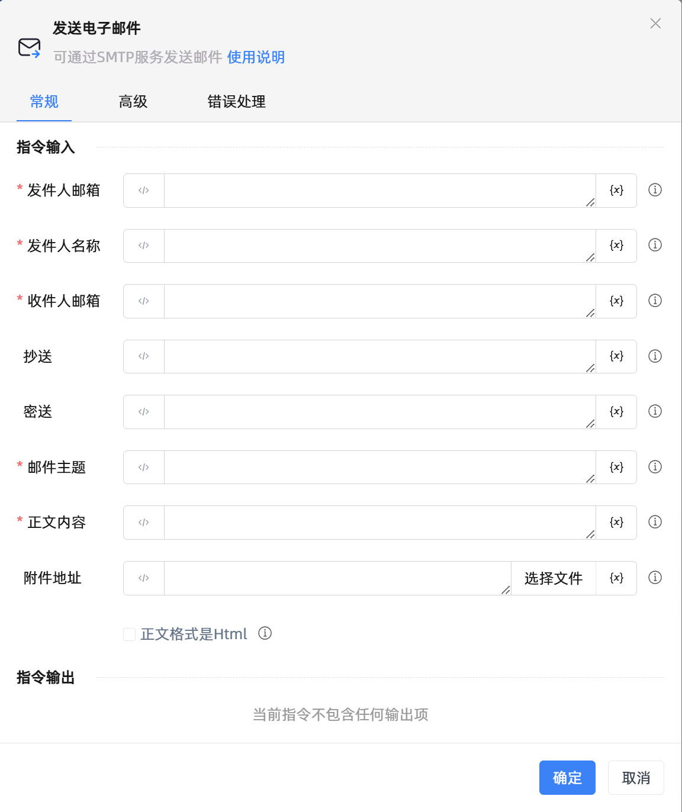

# 发送电子邮件
- 适用系统: windows / 信创

## 功能说明

:::tip 功能描述
可通过SMTP服务发送邮件
:::

## 配置项说明

### 常规

**指令输入**

- **发件人邮箱**`string`: 请输入发件人的电子邮件地址

- **发件人名称**`string`: 请输入发件人的显示名称

- **收件人邮箱**`string`: 请输入主要的电子邮件消息收件人邮箱

- **抄送**`string`: 请输入次要电子邮件消息收件人邮箱

- **密送**`string`: 请输入隐藏的电子邮件消息收件人邮箱

- **邮件主题**`string`: 请输入电子邮件消息的主题

- **正文内容**`string`: 请输入电子邮件消息正文内容

- **附件地址**`string`: 请输入要添加到电子邮件的附件地址

- **正文格式是Html**`Boolean`: 勾选后将以HTML格式写入邮件消息正文

**指令输出**

当前指令无输出

### 高级

- **SMTP服务器**`Integer`: 请选择SMTP服务器，可使用不同SMTP协议发送电子邮件消息

- **指定SMTP端口**`Integer`: 请输入指定的SMTP服务器端口号

- **指定SMTP服务器**`string`: 请输入指定的SMTP服务器地址

- **启用SSL发送**`Boolean`: 勾选后将使用SSL发送消息

- **SSL版本**`Integer`: 请选择指定SSL的版本

- **SMTP身份验证**`Boolean`: 勾选后将对SMTP服务器进行用户身份验证

- **用户名**`string`: 请输入SMTP服务器进行身份验证的用户名

- **授权码**`string`: 请输入SMTP服务器进行身份验证的授权码

- **执行前的延迟(毫秒)**`Integer`: 指令执行前的等待时间

### 错误处理

- **打印错误日志**`Boolean`：当指令运行出错时，打印错误日志到【日志】面板。默认勾选。

- **处理方式**`Integer`：

 - **终止流程**：指令运行出错时，终止流程。

 - **忽略异常并继续执行**：指令运行出错时，忽略异常，继续执行流程。

 - **重试此指令**：指令运行出错时，重试运行指定次数指令，每次重试间隔指定时长。

## 使用示例
无

## 常见错误及处理

无

## 常见问题解答

无

