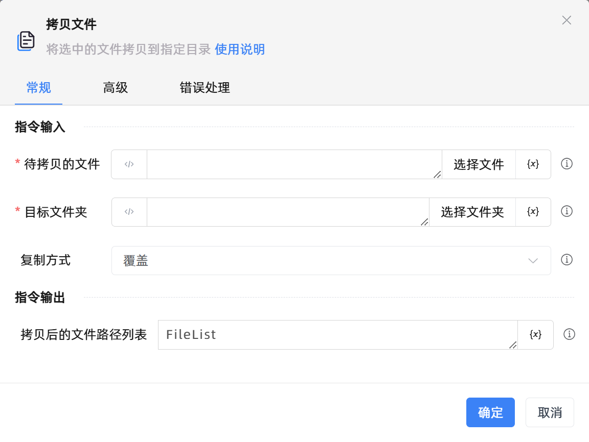

# 拷贝文件
- 适用系统: windows / 信创

## 功能说明

:::tip 功能描述
将选中的文件拷贝到指定目录
:::

## 配置项说明

### 常规

**指令输入**

- **待拷贝的文件**`string`: 请输入或选择要拷贝的文件路径。多个文件路径需要使用'|'分隔

- **目标文件夹**`string`: 请输入目标文件夹路径

- **复制方式**`Integer`: 若文件存在时的处理方式

**指令输出**

- **拷贝后的文件路径列表**`TList<String>`: 输入一个变量，用于保存拷贝后的文件路径列表

### 高级

- **执行前的延迟(毫秒)**`Integer`: 指令执行前的等待时间

### 错误处理

- **打印错误日志**`Boolean`：当指令运行出错时，打印错误日志到【日志】面板。默认勾选。

- **处理方式**`Integer`：

 - **终止流程**：指令运行出错时，终止流程。

 - **忽略异常并继续执行**：指令运行出错时，忽略异常，继续执行流程。

 - **重试此指令**：指令运行出错时，重试运行指定次数指令，每次重试间隔指定时长。

## 使用示例
无

## 常见错误及处理

无

## 常见问题解答

无

