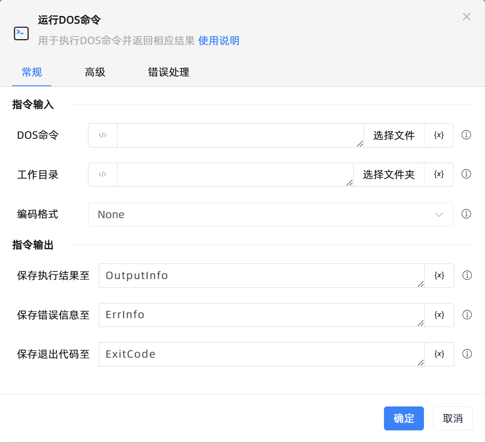

# 运行DOS命令
- 适用系统: windows / 信创

## 功能说明

:::tip 功能描述
用于执行DOS命令并返回相应结果
:::

## 配置项说明

### 常规

**指令输入**

- **DOS命令**`string`: 请输入DOS命令字符串

- **工作目录**`string`: 请指定进程中命令的工作目录

- **编码格式**`Integer`: 请设置命令行的文本格式

**指令输出**

- **保存执行结果至**`string`: 输出一个名称作为保存DOS命令执行结果

- **保存错误信息至**`string`: 输入一个名称作为保存错误信息

- **保存退出代码至**`Integer`: 输入一个名称作为保存退出代码，其类型是整数

### 高级

- **执行前的延迟(毫秒)**`Integer`: 指定指令执行前的等待时间

### 错误处理

- **打印错误日志**`Boolean`：当指令运行出错时，打印错误日志到【日志】面板。默认勾选。

- **处理方式**`Integer`：

 - **终止流程**：指令运行出错时，终止流程。

 - **忽略异常并继续执行**：指令运行出错时，忽略异常，继续执行流程。

 - **重试此指令**：指令运行出错时，重试运行指定次数指令，每次重试间隔指定时长。

## 使用示例
无

## 常见错误及处理

无

## 常见问题解答

无

