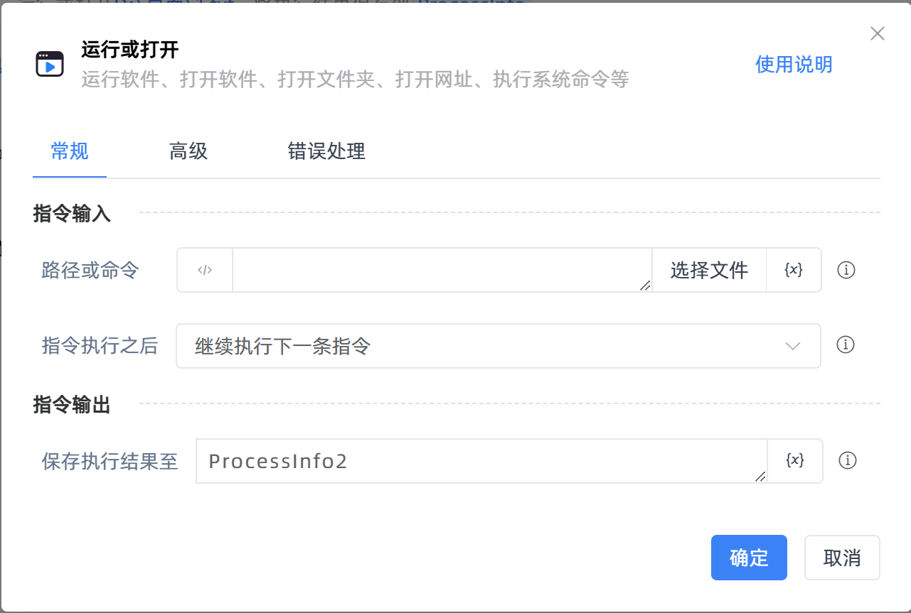

# 运行或打开

## 功能说明

:::tip 功能描述
运行软件、打开软件、打开文件夹、打开网址、执行系统命令等
:::

## 配置项说明

### 常规

**指令输入**

- **路径或命令**`string`: 指定要打开的程序路径或文件路径，或者输入操作系统的命令。它可以是一个完整的文件路径，也可以是一个系统命令（如`notepad.exe`、`ping 192.168.1.1`）
- **指令执行之后**`Integer`: 选择是否继续执行指令，或者等待程序执行结束、文件关闭

**指令输出**

- **保存执行结果至**`TRPADictionary`: 指定一个字典类型变量，用于保存执行结果。

  执行结果字典包含以下键值：

  - **"Handle"**：返回执行的窗口句柄。
  - **"PID"**：返回执行的进程ID。
  - **"ExitCode"**：返回执行任务的退出码，用于判断任务是否成功完成。通常，`ExitCode` 为 `0` 表示成功执行，非零表示执行过程中出现错误或异常。

### 高级

- **窗口风格**`Integer`: 指定新窗口应如何显示

- **以管理员身份运行**`Boolean`: 是否以管理员身份运行

- **工作目录(可选)**`string`: 进程中命令的工作目录

- **参数(可选)**`string`: 程序执行的额外参数

### 错误处理

- **打印错误日志**`Boolean`：当指令运行出错时，打印错误日志到【日志】面板。默认勾选。

- **处理方式**`Integer`：

 - **终止流程**：指令运行出错时，终止流程。

 - **忽略异常并继续执行**：指令运行出错时，忽略异常，继续执行流程。

 - **重试此指令**：指令运行出错时，重试运行指定次数指令，每次重试间隔指定时长。

## 使用示例

**流程逻辑描述：**打开记事本程序-->使用【获取键值】指令获取退出码-->判断退出码是否为0-->若为0则打印日志"运行成功"，否则打印日志"运行异常"

## 常见错误及处理

无

## 常见问题解答

无

