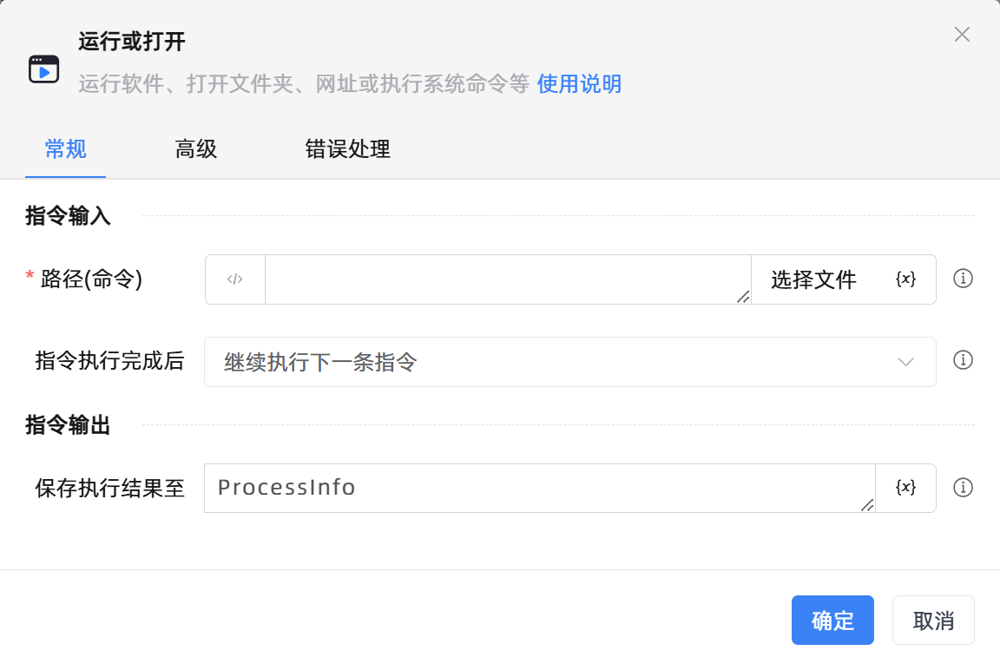

# 运行或打开

## 功能说明

:::tip 功能描述
运行软件、打开文件夹、网址或执行系统命令等
:::

## 配置项说明

### 常规

**指令输入**

- **路径(命令)**`string`: 指定一个程序或者文件

- **指令执行完成后**`Integer`: 选择是否继续执行指令，或等待程序结束/文件关闭

- **等待超时**`Boolean`: 如果不勾选此选项，则表示无限等待

- **等待时间**`Integer`: 等待的最长时间

**指令输出**

- **保存执行结果至**`TRPADictionary`: 输入一个变量，用于保存执行结果

### 高级

- **参数(可选)**`string`: 该程序执行的额外参数

- **工作目录(可选)**`string`: 进程中命令的工作目录

- **窗口尺寸**`Integer`: 设置新窗口以何种大小显示

- **执行前的延迟(毫秒)**`Integer`: 指定指令执行前的等待时间

### 错误处理

- **打印错误日志**`Boolean`：当指令运行出错时，打印错误日志到【日志】面板。默认勾选。

- **处理方式**`Integer`：

 - **终止流程**：指令运行出错时，终止流程。

 - **忽略异常并继续执行**：指令运行出错时，忽略异常，继续执行流程。

 - **重试此指令**：指令运行出错时，重试运行指定次数指令，每次重试间隔指定时长。

## 使用示例
无

## 常见错误及处理

无

## 常见问题解答

无

