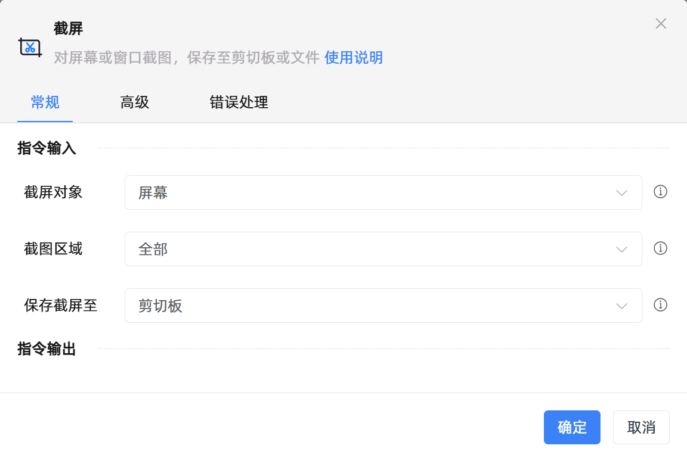

# 截屏

## 功能说明

:::tip 功能描述
对屏幕或窗口截图，保存至剪切板或文件
:::

## 配置项说明

### 常规

**指令输入**

- **截屏对象**`Integer`: 选择截取整个屏幕或部分窗口

- **窗口对象**`TWinObj`: 指定用于截取的窗口对象

- **截图区域**`Integer`: 截取的区域

- **X1坐标**`Integer`: 截屏区域的X1坐标

- **Y1坐标**`Integer`: 截屏区域的Y1坐标

- **X2坐标**`Integer`: 截屏区域的X2坐标

- **Y2坐标**`Integer`: 截屏区域的Y2坐标

- **保存截屏至**`Integer`: 选择截屏的保存位置

- **图片保存位置**`string`: 设置图片保存路径

**指令输出**

- **用户是否取消截图**`string`: 输入变量以保存用户是否取消截图

### 高级

- **执行前的延迟(毫秒)**`Integer`: 指令执行前的等待时间

### 错误处理

- **打印错误日志**`Boolean`：当指令运行出错时，打印错误日志到【日志】面板。默认勾选。

- **处理方式**`Integer`：

 - **终止流程**：指令运行出错时，终止流程。

 - **忽略异常并继续执行**：指令运行出错时，忽略异常，继续执行流程。

 - **重试此指令**：指令运行出错时，重试运行指定次数指令，每次重试间隔指定时长。

## 使用示例
无

## 常见错误及处理

无

## 常见问题解答

无

