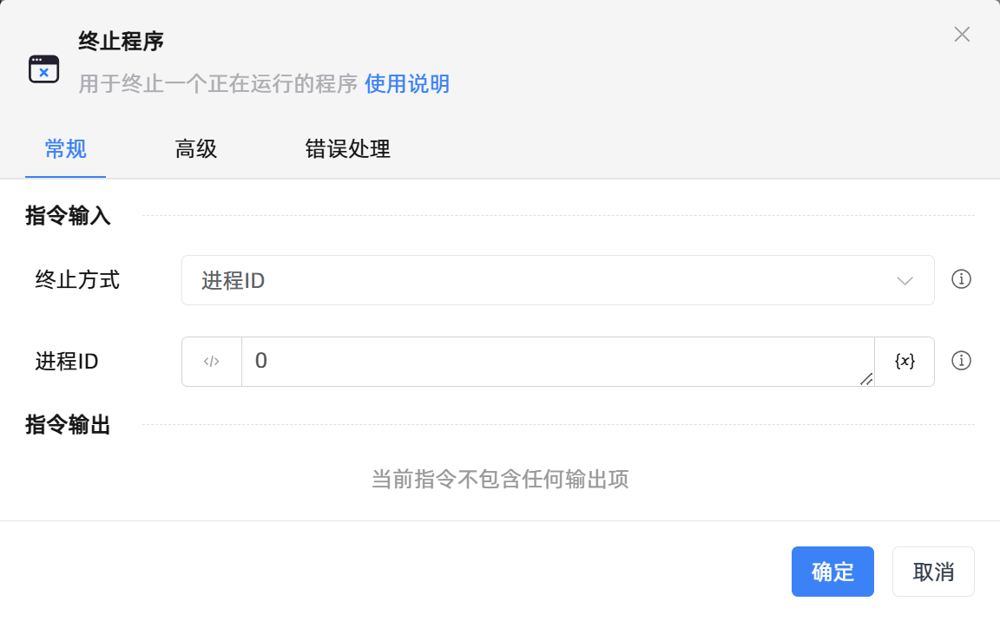

# 终止程序

## 功能说明

:::tip 功能描述
用于终止一个正在运行的程序
:::

## 配置项说明

### 常规

**指令输入**

- **终止方式**`Integer`: 请选择使用进程ID亦或是进程名称终止进程

- **进程名称**`string`: 请输入待终止的进程名称

- **进程ID**`Integer`: 请输入待终止的进程ID

**指令输出**

当前指令无输出

### 高级

- **执行前的延迟(毫秒)**`Integer`: 指令执行前的等待时间

### 错误处理

- **打印错误日志**`Boolean`：当指令运行出错时，打印错误日志到【日志】面板。默认勾选。

- **处理方式**`Integer`：

 - **终止流程**：指令运行出错时，终止流程。

 - **忽略异常并继续执行**：指令运行出错时，忽略异常，继续执行流程。

 - **重试此指令**：指令运行出错时，重试运行指定次数指令，每次重试间隔指定时长。

## 使用示例
无

## 常见错误及处理

无

## 常见问题解答

无

