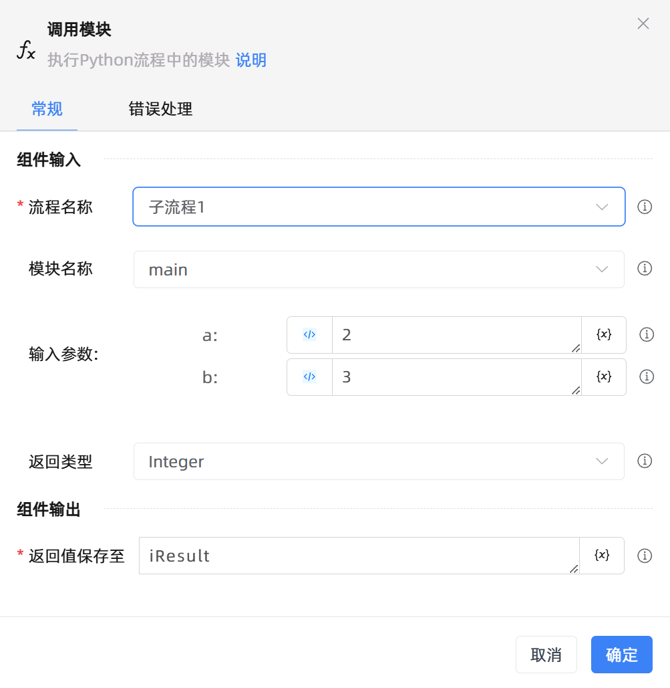

# 调用模块
- 适用系统: windows / 信创

## 功能说明

:::tip 功能描述
执行 Python流程中的模块
:::

## 配置项说明

### 指令输入

  - **流程名称**`string`: 选择要执行的Python流程

  - **模块名称**`string`: 选择Python中需要调用的模块

  - **输入参数**：输入该模块中需要传入的参数

  - **返回类型**：定义返回参数的类型

### 指令输出

- **返回值保存至**`string`: 指定一个变量名称，用于保存流程输出结果

## 使用示例
  - [点击下载查看示例](https://files.oss.krpalite.com:56780/%E5%BA%94%E7%94%A8/%E7%A4%BA%E4%BE%8B_%E8%B0%83%E7%94%A8python%E6%A8%A1%E5%9D%97.krpa) 

