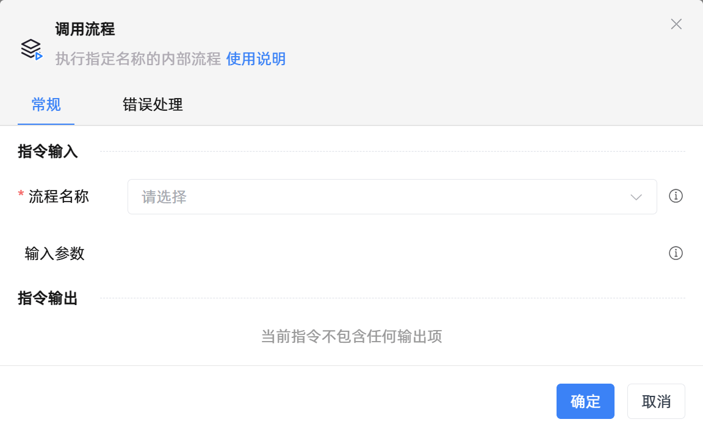

# 调用流程
- 适用系统: windows / 信创

## 功能说明

:::tip 功能描述
执行指定名称的内部流程
:::

## 配置项说明

### 常规

**指令输入**

- **流程名称**`string`: 选择要执行的流程

- **输入参数**`string`: 输入参数

**指令输出**

- **保存流程输出结果至**`string`: 指定一个变量名称，用于保存流程输出结果

### 错误处理

- **打印错误日志**`Boolean`：当指令运行出错时，打印错误日志到【日志】面板。默认勾选。

- **处理方式**`Integer`：

 - **终止流程**：指令运行出错时，终止流程。

 - **忽略异常并继续执行**：指令运行出错时，忽略异常，继续执行流程。

 - **重试此指令**：指令运行出错时，重试运行指定次数指令，每次重试间隔指定时长。

## 使用示例
  - [点击下载查看示例](http://oss.krpalite.com/files/%E5%BA%94%E7%94%A8/%E7%A4%BA%E4%BE%8B_%E8%B0%83%E7%94%A8%E6%B5%81%E7%A8%8B%E5%92%8C%E4%BC%A0%E5%8F%82.krpa) 

