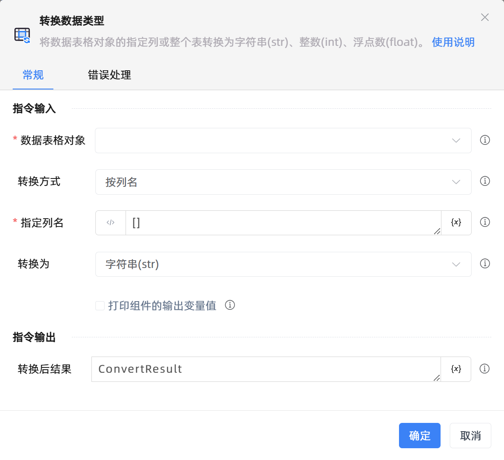

# 转换数据类型

## 功能说明

:::tip 功能描述
将数据表格对象的指定列或整个表转换为字符串(str)、整数(int)、浮点数(float)。
:::

## 配置项说明

### 常规

**指令输入**

- **数据表格对象**`TDataTable`: 可以使用“创建数据表格”组件返回的变量。

- **转换方式**`Integer`: 选择转换方式

- **指定列名**`string`: 输入需要转换数据类型的列，为空口时表示转换整个表，单列输入[列名1]，多列输入[列名1,列名2,列名3]

- **指定列号**`string`: 输入需要转换数据类型的列，为空时表示转换整个表，单列输入[1]，多列输入[1,2,3]

- **转换为**`Integer`: 输入需要转换为何种数据类型。

- **在数据表中预览**`Boolean`: 在数据表中预览

- **打印组件的输出变量值**`Boolean`: 勾选后，将组件运行产生的变量数据或变量值输出，并打印到控制台输出日志中

**指令输出**

- **转换后结果**`TDataTable`: 转换后结果

### 错误处理

- **打印错误日志**`Boolean`：当指令运行出错时，打印错误日志到【日志】面板。默认勾选。

- **处理方式**`Integer`：

 - **终止流程**：指令运行出错时，终止流程。

 - **忽略异常并继续执行**：指令运行出错时，忽略异常，继续执行流程。

 - **重试此指令**：指令运行出错时，重试运行指定次数指令，每次重试间隔指定时长。

## 使用示例
无

## 常见错误及处理

无

## 常见问题解答

无

