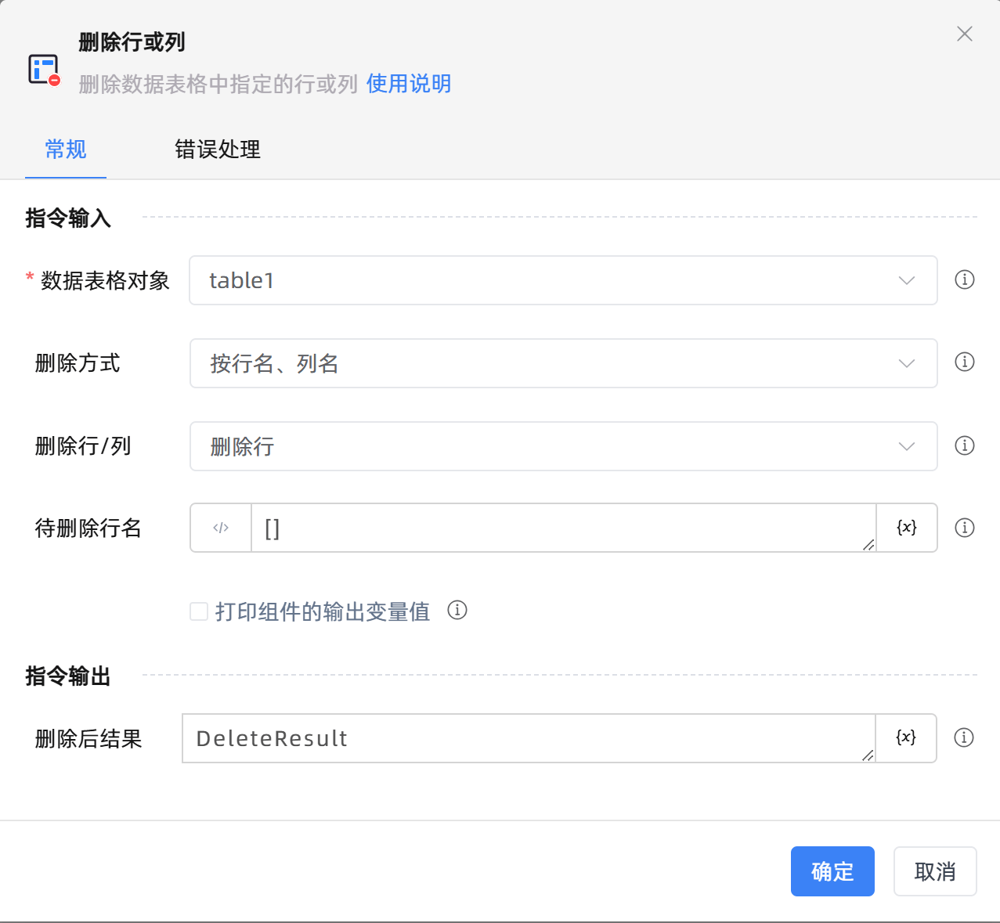

# 删除行或列
- 适用系统: windows / 信创

## 功能说明

:::tip 功能描述
删除数据表格中指定的行或列
:::

## 配置项说明

### 常规

**指令输入**

- **数据表格对象**`TDataTable`: 可以使用“创建数据表格”组件返回的变量。

- **删除方式**`Integer`: 行名、列名是数据表格中指定的表头。行号、列号是数据表格中的行序号、列序号，是一个整数。

- **删除行/列**`Integer`: 删除行/列

- **待删除行名**`string`: 支持单行和多行，示例：[行名]或[行名1,行名2,行名3]。行名默认为数据表格每一行的首位

- **待删除列名**`string`: 支持单列和多列，示例：[列名]或[列名1,列名2,列名3]

- **待删除行号**`string`: 支持单行和多行，示例：[1]或[1,2,3]

- **待删除列号**`string`: 支持单列和多列，示例：[1]或[1,2,3]

- **在数据表中预览**`Boolean`: 在数据表中预览

- **打印组件的输出变量值**`Boolean`: 勾选后，将组件运行产生的变量数据或变量值输出，并打印到控制台输出日志中

**指令输出**

- **删除后结果**`TDataTable`: 删除行/列之后的数据表格。

### 错误处理

- **打印错误日志**`Boolean`：当指令运行出错时，打印错误日志到【日志】面板。默认勾选。

- **处理方式**`Integer`：

 - **终止流程**：指令运行出错时，终止流程。

 - **忽略异常并继续执行**：指令运行出错时，忽略异常，继续执行流程。

 - **重试此指令**：指令运行出错时，重试运行指定次数指令，每次重试间隔指定时长。

## 使用示例
无

## 常见错误及处理

无

## 常见问题解答

无

