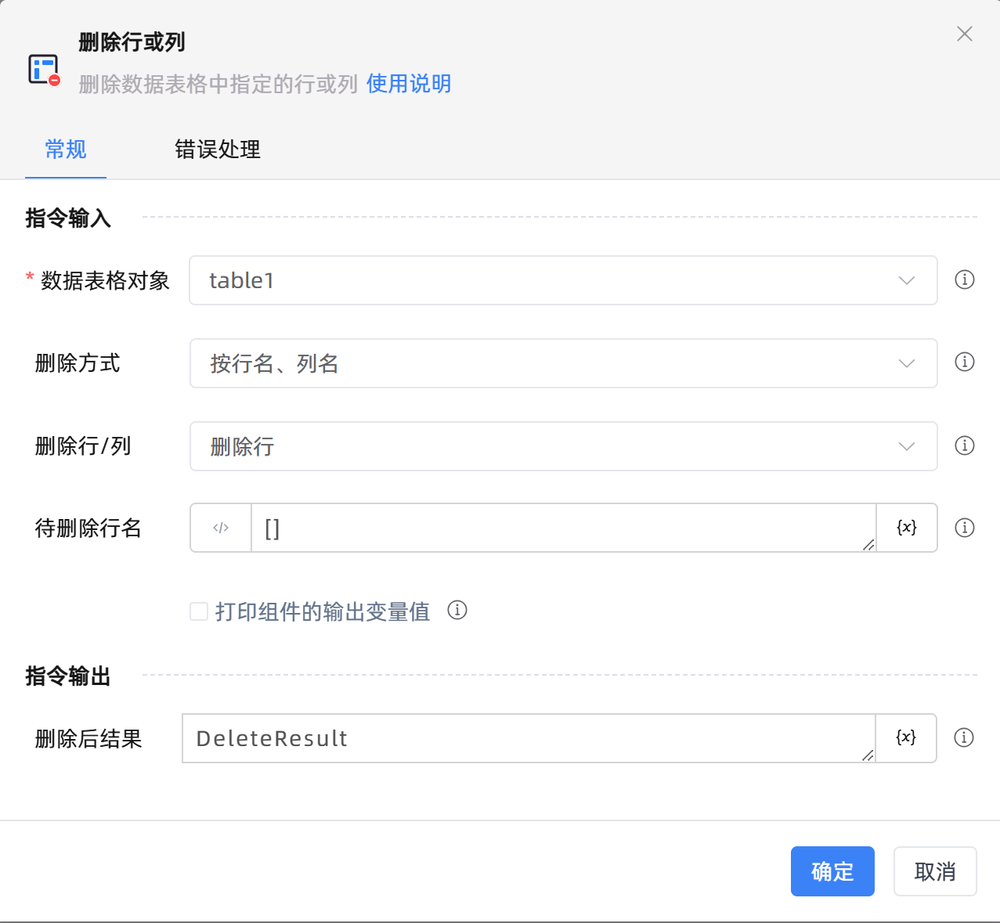

# 删除行或列
- 适用系统: windows / 信创

## 功能说明

:::tip 功能描述
删除数据表格中指定的行或列
:::

## 配置项说明

### 指令输入

- **数据表格对象**`TDataTable`: 
  - 可以使用“创建数据表格”组件返回的变量。

- **删除方式**`Integer`: 
  - 行名、列名是数据表格中指定的表头。行号、列号是数据表格中的行序号、列序号，是一个整数。

- **删除行/列**`Integer`: 
  - 删除行/列

- **待删除行名**`string`: 
  - 支持单行和多行，示例：[行名]或[行名1,行名2,行名3]。行名默认为数据表格每一行的首位

- **待删除列名**`string`: 
  - 支持单列和多列，示例：[列名]或[列名1,列名2,列名3]

- **待删除行号**`string`: 
  - 支持单行和多行，示例：[1]或[1,2,3]

- **待删除列号**`string`: 
  - 支持单列和多列，示例：[1]或[1,2,3]

- **在数据表中预览**`Boolean`: 
  - 在数据表中预览

- **打印组件的输出变量值**`Boolean`: 
  - 勾选后，将组件运行产生的变量数据或变量值输出，并打印到控制台输出日志中

### 指令输出

- **删除后结果**`TDataTable`: 
  - 删除行/列之后的数据表格。

### 使用示例

- [点击下载查看示例](https://files.oss.krpalite.com:56780/%E5%BA%94%E7%94%A8/%E7%A4%BA%E4%BE%8B_%E5%88%A0%E9%99%A4%E8%A1%8C%E6%88%96%E5%88%97.krpa) 
