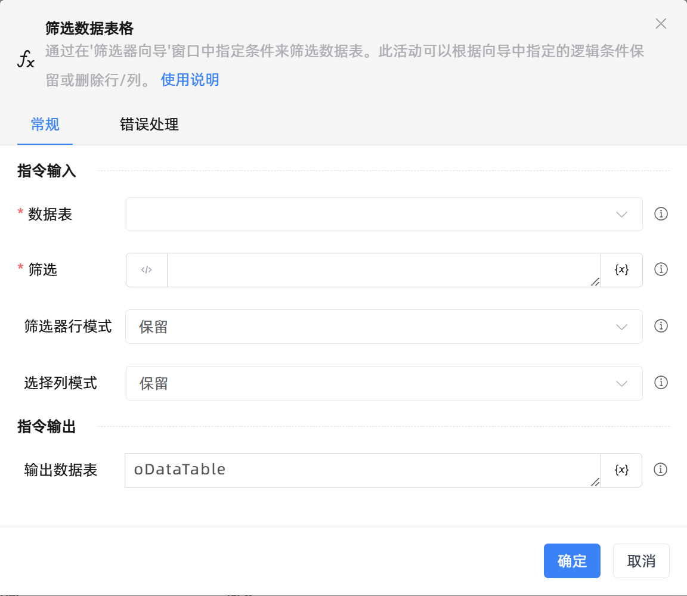

# 筛选数据表格

## 功能说明

:::tip 功能描述
通过在'筛选'中指定条件来筛选数据表。根据指定的逻辑条件保留或删除行/列。
:::

## 配置项说明

### 常规

**指令输入**

- **数据表**`TDataTable`: 要筛选的数据表。

- **筛选**`String`: 设置筛选条件，可通过与或设置多条条件。

- **去重**`Boolean`: 数据重复时，数据去重

- **优化模式**`Boolean`: 优化保留删除筛选模式

- **在数据表中预览**`Boolean`: 在数据表中预览

- **打印组件的输出变量值**`Boolean`: 勾选后，将组件运行产生的变量数据或变量值输出，并打印到控制台输出日志中

**指令输出**

- **输出数据表**`TDataTable`: 生成的已筛选数据表变量。

### 错误处理

- **打印错误日志**`Boolean`：当指令运行出错时，打印错误日志到【日志】面板。默认勾选。

- **处理方式**`Integer`：

 - **终止流程**：指令运行出错时，终止流程。

 - **忽略异常并继续执行**：指令运行出错时，忽略异常，继续执行流程。

 - **重试此指令**：指令运行出错时，重试运行指定次数指令，每次重试间隔指定时长。

## 使用示例

**流程逻辑描述：** 

## 常见错误及处理

无

## 常见问题解答

无

