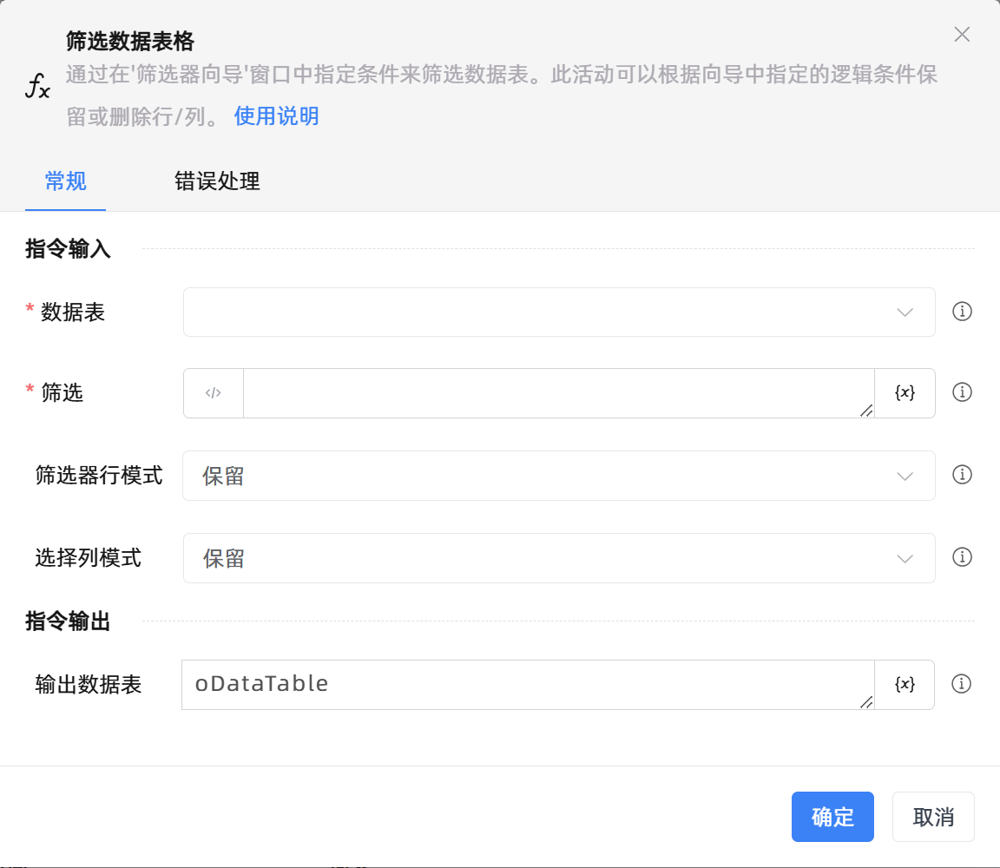

# 筛选数据表格
- 适用系统: windows / 信创

## 功能说明

:::tip 功能描述
通过在'筛选'中指定条件来筛选数据表。根据指定的逻辑条件保留或删除行/列。
:::

## 配置项说明

### 指令输入

- **数据表**`TDataTable`: 
  - 要筛选的数据表。

- **筛选**`string`: 
  - 设置筛选条件，可通过与或设置多条条件。

- **去重**`string`: 
  - 数据重复时，数据去重

- **在数据表中预览**`Boolean`: 
  - 在数据表中预览

- **打印组件的输出变量值**`Boolean`: 
  - 勾选后，将组件运行产生的变量数据或变量值输出，并打印到控制台输出日志中

- **忽略首行**`Boolean`: 
  - 勾选后，将忽略数据表格的首行数据进行转换

### 指令输出

- **输出数据表**`TDataTable`: 
  - 生成的已筛选数据表变量。

### 使用示例

- [点击下载查看示例](https://files.oss.krpalite.com:56780/%E5%BA%94%E7%94%A8/%E7%A4%BA%E4%BE%8B_%E7%AD%9B%E9%80%89%E6%95%B0%E6%8D%AE%E8%A1%A8%E6%A0%BC.krpa) 
