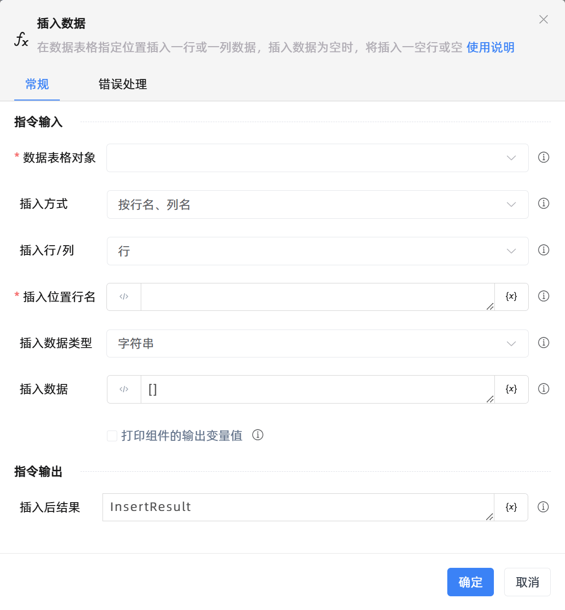

# 插入数据

## 功能说明

:::tip 功能描述
在数据表格指定位置插入一行或一列数据，插入数据为空时，将插入一空行或空
:::

## 配置项说明

### 常规

**指令输入**

- **数据表格对象**`TDataTable`: 可以使用“创建数据表格”组件返回的变量。

- **插入方式**`Integer`: 行名、列名是数据表格中指定的表头。行号、列号是数据表格中的行序号、列序号，是一个整数。

- **插入行/列**`Integer`: 在指定的行或列插入数据

- **插入位置行名**`string`: 输入插入位置所在行标签，行名默认为数据表格每一行的首位

- **插入位置行号**`Integer`: 输入插入位置所在行序号，支持1或-1，-n表示倒数第n行

- **插入位置列名**`string`: 输入插入位置所在列标签

- **插入位置列号**`Integer`: 输入插入位置所在列序号，支持1或-1，-n表示倒数第n列

- **插入数据列名**`string`: 输入插入数据列名

- **插入数据类型**`Integer`: 选择插入数据的类型。

- **插入数据**`string`: 插入数据为数组格式, 例如[字符串1,字符串2]或[字符串,'双引号"',"单引号'",1,0.01]

- **在数据表中预览**`Boolean`: 在数据表中预览

- **打印组件的输出变量值**`Boolean`: 勾选后，将组件运行产生的变量数据或变量值输出，并打印到控制台输出日志中

**指令输出**

- **插入后结果**`TDataTable`: 插入数据之后的数据表格

### 错误处理

- **打印错误日志**`Boolean`：当指令运行出错时，打印错误日志到【日志】面板。默认勾选。

- **处理方式**`Integer`：

 - **终止流程**：指令运行出错时，终止流程。

 - **忽略异常并继续执行**：指令运行出错时，忽略异常，继续执行流程。

 - **重试此指令**：指令运行出错时，重试运行指定次数指令，每次重试间隔指定时长。

## 使用示例

**流程逻辑描述：** 

## 常见错误及处理

无

## 常见问题解答

无

