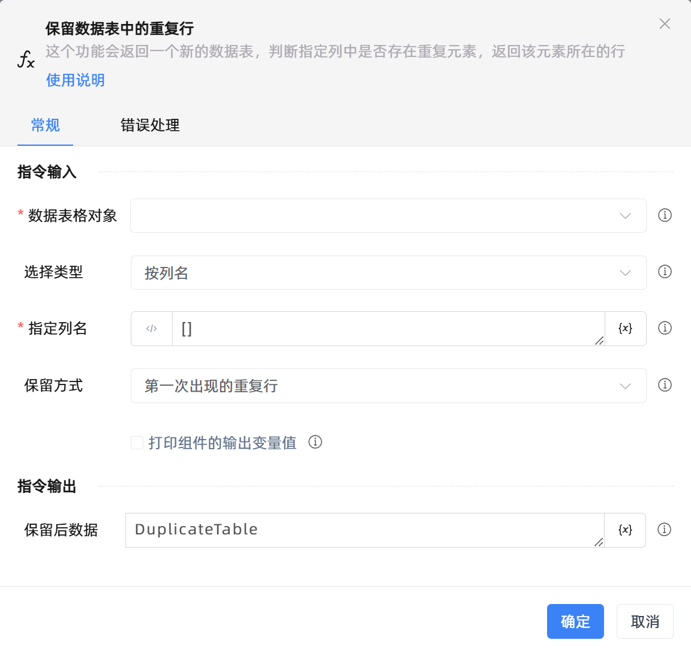

# 保留数据表中的重复行
- 适用系统: windows / 信创

## 功能说明

:::tip 功能描述
这个功能会返回一个新的数据表，判断指定列中是否存在重复元素，返回该元素所在的行
:::

## 配置项说明

### 常规

**指令输入**

- **数据表格对象**`TDataTable`: 可以使用“创建数据表格”组件返回的变量。

- **选择类型**`Integer`: 选择列名或列号

- **指定列名**`string`: 所选列数据都一致时则保留。单列输入[列名]，多列输入[列名1,列名2,列名3]

- **指定列号**`string`: 所选列数据都一致时则保留。单列输入[1]，多列输入[1,2,3]

- **保留方式**`Integer`: 选择保留方式

- **在数据表中预览**`Boolean`: 在数据表中预览

- **打印组件的输出变量值**`Boolean`: 勾选后，将组件运行产生的变量数据或变量值输出，并打印到控制台输出日志中

**指令输出**

- **保留后数据**`TDataTable`: 保留后返回的数据表格

### 错误处理

- **打印错误日志**`Boolean`：当指令运行出错时，打印错误日志到【日志】面板。默认勾选。

- **处理方式**`Integer`：

 - **终止流程**：指令运行出错时，终止流程。

 - **忽略异常并继续执行**：指令运行出错时，忽略异常，继续执行流程。

 - **重试此指令**：指令运行出错时，重试运行指定次数指令，每次重试间隔指定时长。

## 使用示例
无

## 常见错误及处理

无

## 常见问题解答

无

