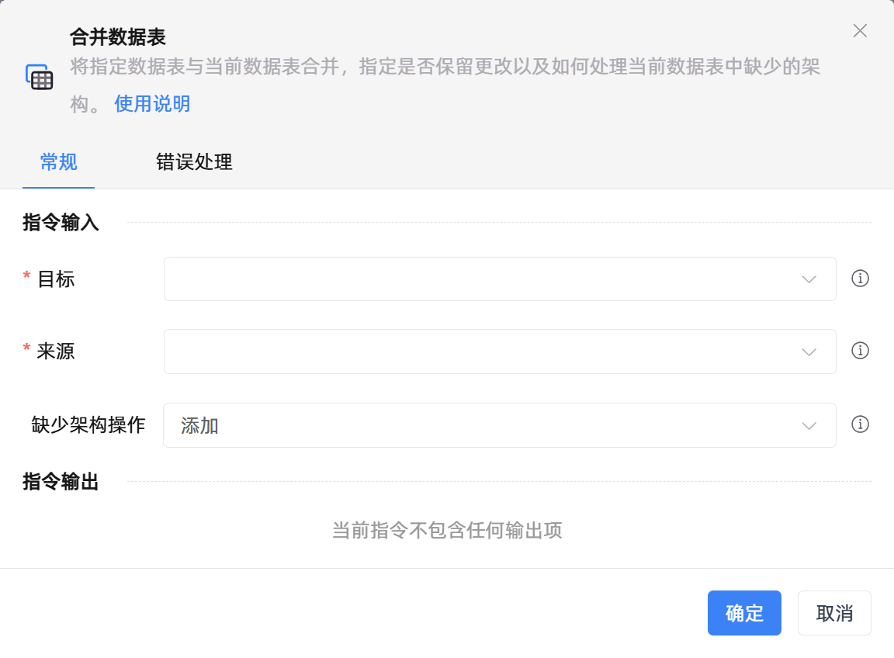

# 合并数据表
- 适用系统: windows / 信创

## 功能说明

:::tip 功能描述
将指定数据表与当前数据表合并，指定是否保留更改以及如何处理当前数据表中缺少的架构。
:::

## 配置项说明

### 常规

**指令输入**

- **目标**`TDataTable`: 要将源数据表合并到的数据表对象。

- **来源**`TDataTable`: 要添加到目标数据表的数据表对象。

- **缺少架构操作**`Integer`: 缺少架构操作

- **在数据表中预览**`Boolean`: 在数据表中预览

- **打印组件的输出变量值**`Boolean`: 勾选后，将组件运行产生的变量数据或变量值输出，并打印到控制台输出日志中

**指令输出**

- **输出数据表**`TDataTable`: 生成的已合并的数据表变量。

### 错误处理

- **打印错误日志**`Boolean`：当指令运行出错时，打印错误日志到【日志】面板。默认勾选。

- **处理方式**`Integer`：

 - **终止流程**：指令运行出错时，终止流程。

 - **忽略异常并继续执行**：指令运行出错时，忽略异常，继续执行流程。

 - **重试此指令**：指令运行出错时，重试运行指定次数指令，每次重试间隔指定时长。

## 使用示例
无

## 常见错误及处理

无

## 常见问题解答

无

