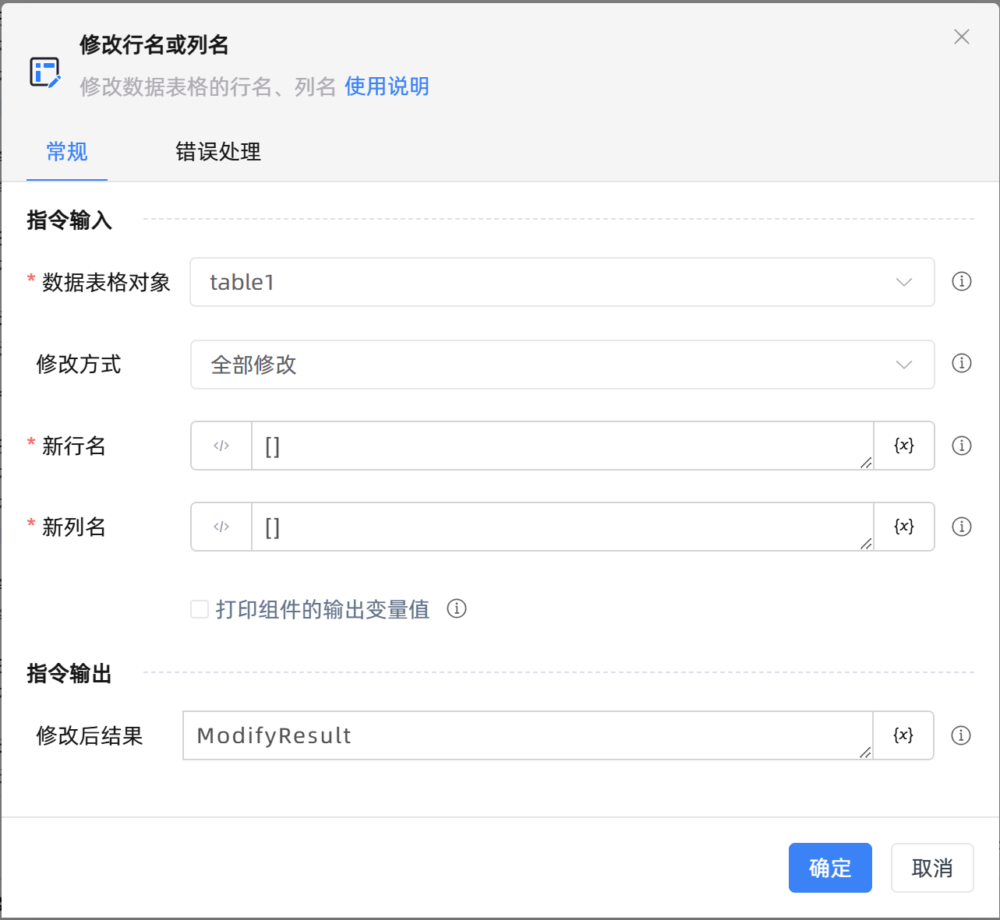

# 修改行名或列名
- 适用系统: windows / 信创

## 功能说明

:::tip 功能描述
修改数据表格的行名、列名
:::

## 配置项说明

### 常规

**指令输入**

- **数据表格对象**`TDataTable`: 可以使用“创建数据表格”组件返回的变量。

- **修改方式**`Integer`: 支持将数据表格的表头名全部一起修改或仅修改其中部分。

- **新行名**`string`: 输入与原行名长度一致的列表。为[]时，将不修改原行名。例如[行名1,行名2],行名默认为数据表格每一行的首位。

- **新列名**`string`: 输入与原列名长度一致的列表。为[]时，将不修改原列名。例如[列名1,列名2]

- **修改行名**`string`: 输入原行名和新行名。例如{"原行名1":"新行名1","原行名2":"新行名2"}

- **修改列号**`string`: 输入原列名和新列名。例如{"原列名1":"新列名1","原列名2":"新列名2"}

- **在数据表中预览**`Boolean`: 在数据表中预览

- **打印组件的输出变量值**`Boolean`: 勾选后，将组件运行产生的变量数据或变量值输出，并打印到控制台输出日志中

**指令输出**

- **修改后结果**`TDataTable`: 修改行名/列名之后的数据表格

### 错误处理

- **打印错误日志**`Boolean`：当指令运行出错时，打印错误日志到【日志】面板。默认勾选。

- **处理方式**`Integer`：

 - **终止流程**：指令运行出错时，终止流程。

 - **忽略异常并继续执行**：指令运行出错时，忽略异常，继续执行流程。

 - **重试此指令**：指令运行出错时，重试运行指定次数指令，每次重试间隔指定时长。

## 使用示例
无

## 常见错误及处理

无

## 常见问题解答

无

