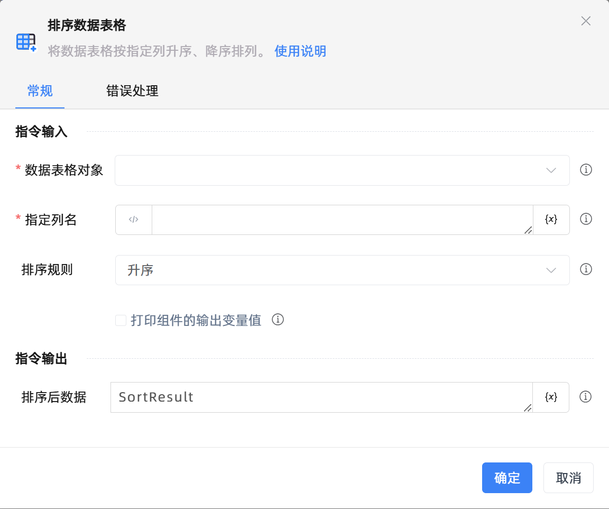

# 排序数据表格
- 适用系统: windows / 信创

## 功能说明

:::tip 功能描述
将数据表格按指定列升序、降序排列。
:::

## 配置项说明

### 指令输入

- **数据表格对象**`TDataTable`: 
  - 可以使用“创建数据表格”组件返回的变量。

- **指定列名**`string`: 
  - 指定按哪一列进行排序

- **排序规则**`Integer`: 
  - 根据指定的列按升序或者降序排列。

- **在数据表中预览**`Boolean`: 
  - 在数据表中预览

- **打印组件的输出变量值**`Boolean`: 
  - 勾选后，将组件运行产生的变量数据或变量值输出，并打印到控制台输出日志中

- **忽略首行**`Boolean`: 
  - 勾选后，该列的首行将不参与计算

### 指令输出

- **排序后数据**`Integer`: 
  - 用于存储排序后的数据表格。

### 使用示例

- [点击下载查看示例](https://files.oss.krpalite.com:56780/%E5%BA%94%E7%94%A8/%E7%A4%BA%E4%BE%8B_%E6%8E%92%E5%BA%8F%E6%95%B0%E6%8D%AE%E8%A1%A8%E6%A0%BC.krpa) 
