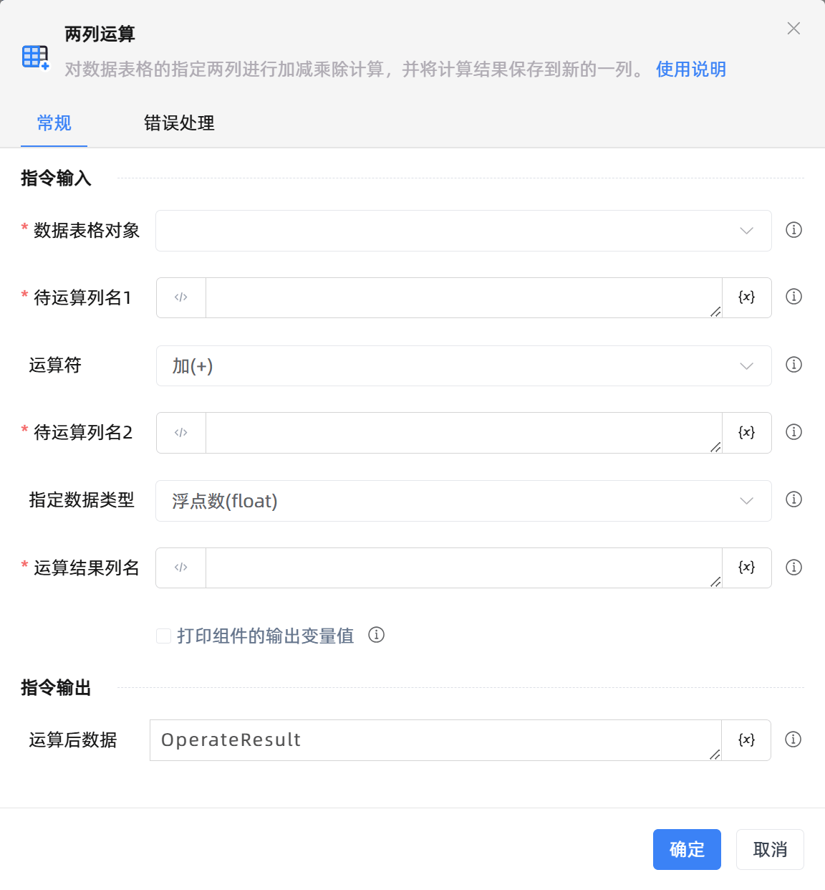

# 两列运算

## 功能说明

:::tip 功能描述
对数据表格的指定两列进行加减乘除计算，并将计算结果保存到新的一列。
:::

## 配置项说明

### 常规

**指令输入**

- **数据表格对象**`TDataTable`: 可以使用“创建数据表格”组件返回的变量。

- **待运算列名1**`string`: 指定需要进行运算的列名。

- **运算符**`Integer`: 选择运算符。

- **待运算列名2**`string`: 指定需要进行运算的列名。

- **指定数据类型**`Integer`: 指定计算结果的数据类型。

- **运算结果列名**`string`: 指定新增运算结果列的列名。

- **打印组件的输出变量值**`Boolean`: 勾选后，将组件运行产生的变量数据或变量值输出，并打印到控制台输出日志中

**指令输出**

- **运算后数据**`TDataTable`: 用于存储运算后的数据表格。

### 错误处理

- **打印错误日志**`Boolean`：当指令运行出错时，打印错误日志到【日志】面板。默认勾选。

- **处理方式**`Integer`：

 - **终止流程**：指令运行出错时，终止流程。

 - **忽略异常并继续执行**：指令运行出错时，忽略异常，继续执行流程。

 - **重试此指令**：指令运行出错时，重试运行指定次数指令，每次重试间隔指定时长。

## 使用示例

**流程逻辑描述：** 

## 常见错误及处理

无

## 常见问题解答

无

