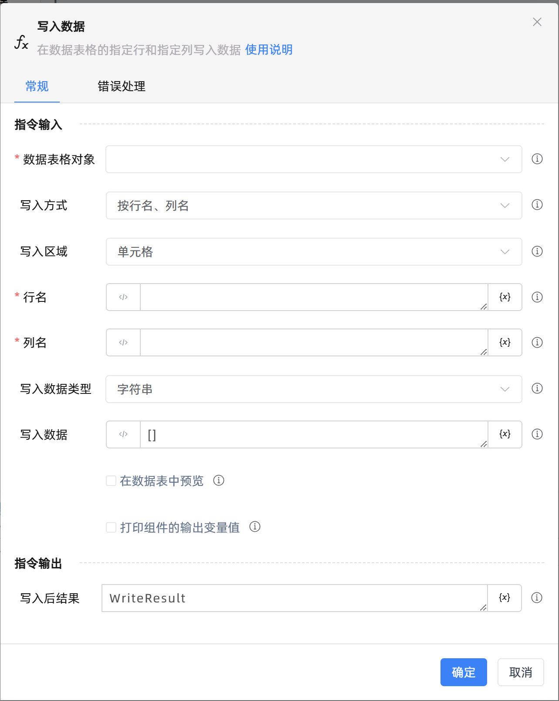

# 写入数据

## 功能说明

:::tip 功能描述
在数据表格的指定行和指定列写入数据
:::

## 配置项说明

### 常规

**指令输入**

- **数据表格对象**`TDataTable`: 可以使用“创建数据表格”组件返回的变量。

- **写入方式**`Integer`: 选择按指定的行名、列名读取数据，或者按指定的行号、列号读取数据。

- **写入区域**`Integer`: 选择按指定的行名、列名读取数据，或者按指定的行号、列号读取数据。

- **行名**`string`: 行名默认为数据表格每一行的首位

- **列名**`string`: 列名

- **行号**`Integer`: 行号

- **列号**`Integer`: 列号

- **写入数据类型**`Integer`: 选择写入数据的类型。

- **写入数据**`string`: 写入数据为数组格式, 例如[""]或[字符串1,字符串2]或[字符串,'双引号"',"单引号'",1,0.01]

- **在数据表中预览**`Boolean`: 在数据表中预览

- **打印组件的输出变量值**`Boolean`: 勾选后，将组件运行产生的变量数据或变量值输出，并打印到控制台输出日志中

**指令输出**

- **写入后结果**`TDataTable`: 输出写入数据成功后的数据表格。

### 错误处理

- **打印错误日志**`Boolean`：当指令运行出错时，打印错误日志到【日志】面板。默认勾选。

- **处理方式**`Integer`：

 - **终止流程**：指令运行出错时，终止流程。

 - **忽略异常并继续执行**：指令运行出错时，忽略异常，继续执行流程。

 - **重试此指令**：指令运行出错时，重试运行指定次数指令，每次重试间隔指定时长。

## 使用示例
无

## 常见错误及处理

无

## 常见问题解答

无

