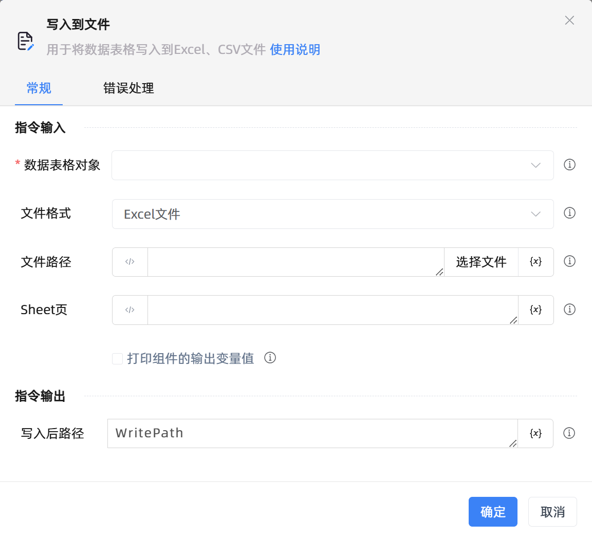

# 写入到文件
- 适用系统: windows / 信创

## 功能说明

:::tip 功能描述
用于将数据表格写入到Excel、CSV文件
:::

## 配置项说明

### 常规

**指令输入**

- **数据表格对象**`TDataTable`: 可使用“创建数据表格”组件返回的变量。

- **文件格式**`Integer`: 支持将数据表格导出至Excel文件、CSV文件。

- **文件路径**`string`: 输入或选择文件路径

- **Sheet页**`string`: 为空则默认为当前激活的Sheet页

- **打印组件的输出变量值**`Boolean`: 若勾选此选项，会将组件运行产生的变量数据或变量值输出，并打印到控制台输出日志中

**指令输出**

- **写入后路径**`string`: 用于输出写入成功后的路径

### 错误处理

- **打印错误日志**`Boolean`：当指令运行出错时，打印错误日志到【日志】面板。默认勾选。

- **处理方式**`Integer`：

 - **终止流程**：指令运行出错时，终止流程。

 - **忽略异常并继续执行**：指令运行出错时，忽略异常，继续执行流程。

 - **重试此指令**：指令运行出错时，重试运行指定次数指令，每次重试间隔指定时长。

## 使用示例
无

## 常见错误及处理

无

## 常见问题解答

无

