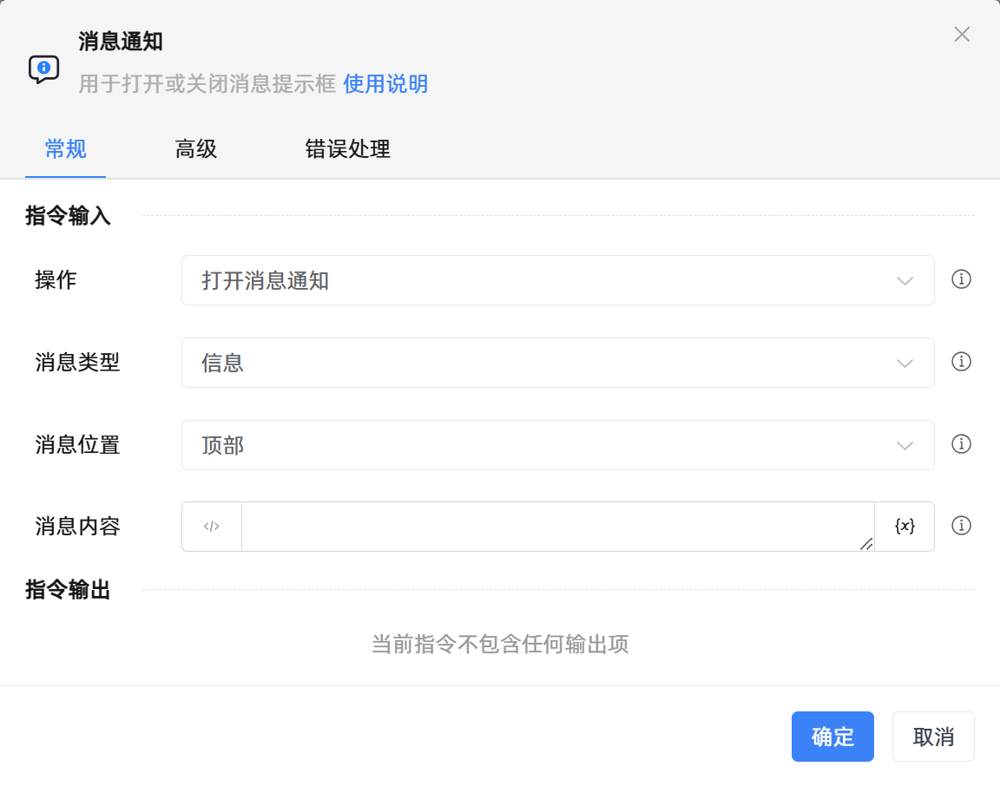

# 消息通知

## 功能说明

:::tip 功能描述
用于打开或关闭消息提示框
:::

## 配置项说明

### 常规

**指令输入**

- **操作**`Integer`: 可选择打开或者关闭消息通知框

- **消息类型**`Integer`: 提示框展示的消息类型，可选择：信息、警告、错误

- **消息位置**`Integer`: 提示框展示时相对屏幕的位置，可选择：顶部、底部、右下角

- **消息内容**`string`: 提示框要展示给用户的内容

**指令输出**

当前指令无输出

### 高级

- **关闭的超时时间(毫秒)**`Integer`: 通知信息展示的时长，默认为3000毫秒

### 错误处理

- **打印错误日志**`Boolean`：当指令运行出错时，打印错误日志到【日志】面板。默认勾选。

- **处理方式**`Integer`：

 - **终止流程**：指令运行出错时，终止流程。

 - **忽略异常并继续执行**：指令运行出错时，忽略异常，继续执行流程。

 - **重试此指令**：指令运行出错时，重试运行指定次数指令，每次重试间隔指定时长。

## 使用示例
无

## 常见错误及处理

无

## 常见问题解答

无

