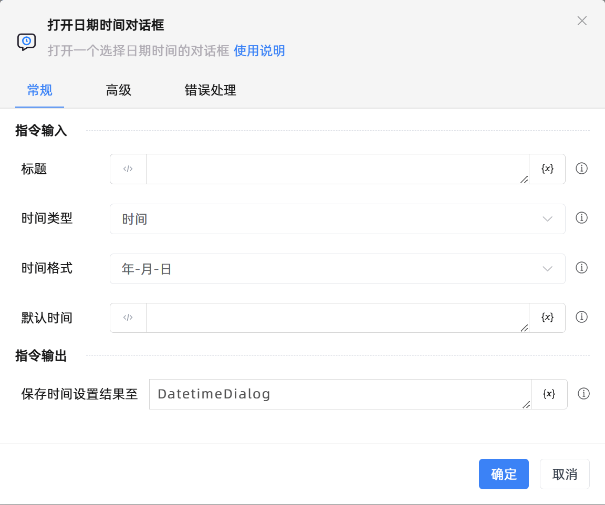

# 打开日期时间对话框

## 功能说明

:::tip 功能描述
打开一个选择日期时间的对话框
:::

## 配置项说明

### 常规

**指令输入**

- **标题**`string`: 请输入对话框标题

- **时间类型**`Integer`: 请选择时间类型

- **时间格式**`Integer`: 请选择时间格式

- **默认时间**`string`: 默认时间

- **起始时间**`string`: 请指定起始时间

- **终止时间**`string`: 请指定终止时间

**指令输出**

- **保存时间设置结果至**`TRPADictionary`: 指定一个变量名称，用于保存时间设置结果，若用户取消对话框，则返回 None，若未取消则返回 dict 对象

### 高级

- **说明**`string`: 请输入对话框说明

- **超时的时间(毫秒)**`Integer`: 通知信息的展示的时长，默认为30000毫秒

### 错误处理

- **打印错误日志**`Boolean`：当指令运行出错时，打印错误日志到【日志】面板。默认勾选。

- **处理方式**`Integer`：

    - **终止流程**：指令运行出错时，终止流程。

    - **忽略异常并继续执行**：指令运行出错时，忽略异常，继续执行流程。

    - **重试此指令**：指令运行出错时，重试运行指定次数指令，每次重试间隔指定时长。

## 使用示例
无

## 常见错误及处理

无

## 常见问题解答

无

