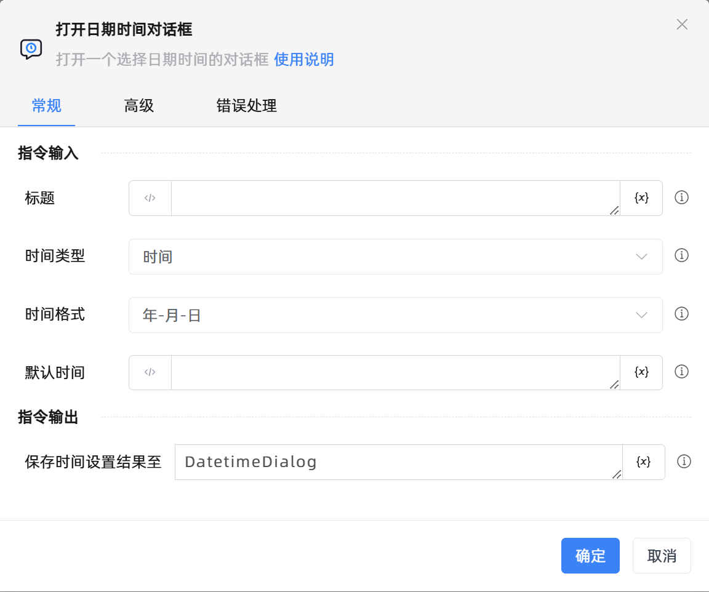

# 打开日期时间对话框
- 适用系统: windows / 信创

## 功能说明

:::tip 功能描述
打开一个选择日期时间的对话框
:::

## 配置项说明

### 指令输入

- **标题**`string`: 
  - 请输入对话框标题

- **时间类型**`Integer`: 
  - 请选择时间类型

- **时间格式**`Integer`: 
  - 请选择时间格式

- **默认时间**`string`: 
  - 默认时间

- **起始时间**`string`: 
  - 请指定起始时间

- **终止时间**`string`: 
  - 请指定终止时间

- **说明**`string`: 
  - 请输入对话框说明

- **超时的时间(毫秒)**`string`: 
  - 通知信息的展示的时长，默认为30000毫秒

### 指令输出

- **保存时间设置结果至**`string`: 
  - 指定一个变量名称，用于保存时间设置结果，若用户取消对话框，则返回 None，若未取消则返回 dict 对象

### 使用示例

- [点击下载查看示例](https://files.oss.krpalite.com:56780/%E5%BA%94%E7%94%A8/%E7%A4%BA%E4%BE%8B_%E6%89%93%E5%BC%80%E6%97%A5%E6%9C%9F%E6%97%B6%E9%97%B4%E5%AF%B9%E8%AF%9D%E6%A1%86.krpa) 
