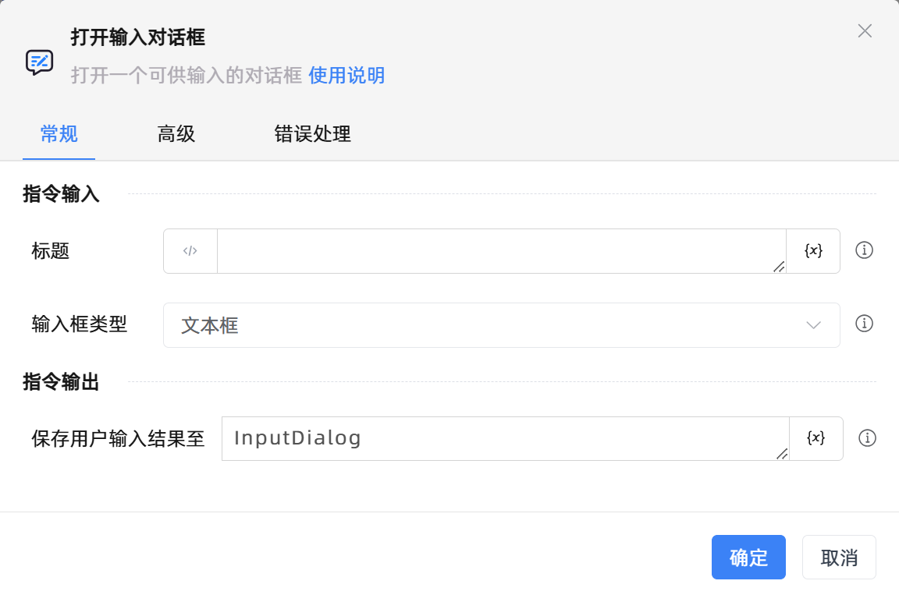

# 打开输入对话框
- 适用系统: windows / 信创

## 功能说明

:::tip 功能描述
打开一个可供输入的对话框
:::

## 配置项说明

### 指令输入

- **标题**`string`: 
  - 请输入对话框标题

- **输入框类型**`Integer`: 
  - 请选择输入框类型

- **说明**`string`: 
  - 前请输入对话框说明

- **默认值**`string`: 
  - 指定输入框的默认值

- **超时的时间(毫秒)**`string`: 
  - 通知信息展示的时长，默认为30000毫秒

### 指令输出

- **保存用户输入结果至**`string`: 
  - 指定一个变量名称，用于保存用户输入的结果；若用户取消对话框，则返回 None，若未取消则返回 dict 对象

### 使用示例

- [点击下载查看示例]() 
