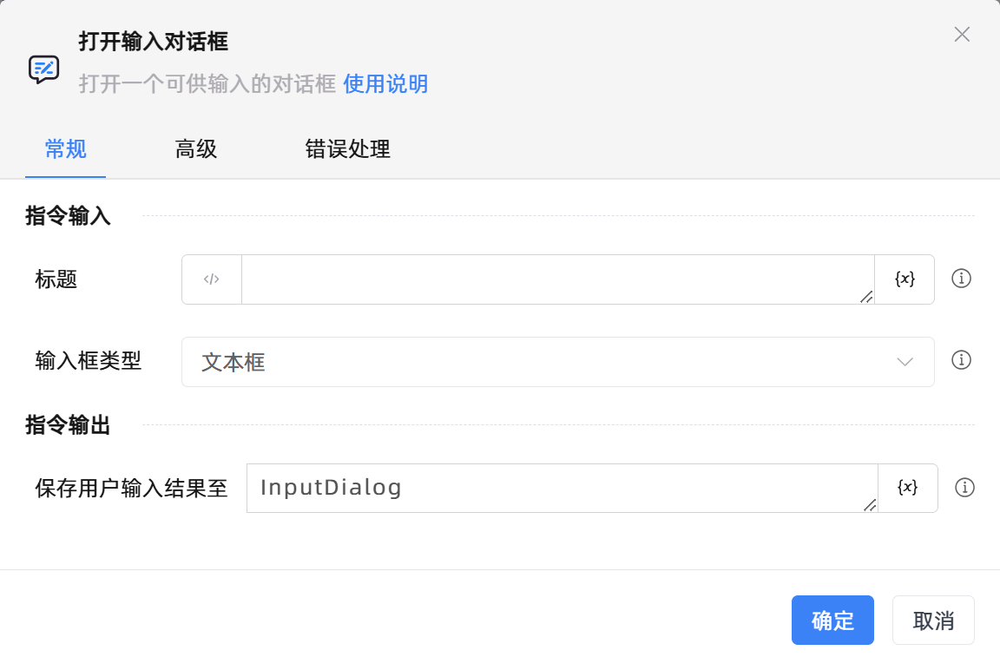

# 打开输入对话框

## 功能说明

:::tip 功能描述
打开输入对话框
:::

## 配置项说明

### 常规

**指令输入**

- **对话框标题**`string`: 对话框标题

- **输入框类型**`Integer`: 输入框类型

**指令输出**

- **保存用户输入结果至**`TRPADictionary`: 指定一个变量名称，该变量用于保存用户输入结果，如果用户取消对话框则返回None否则返回dict对象

### 高级

- **对话框说明**`string`: 对话框说明

- **默认值**`string`: 默认值

- **超时时间(毫秒)**`Integer`: 通知信息展示时长，默认为30000毫秒

### 错误处理

- **打印错误日志**`Boolean`：当指令运行出错时，打印错误日志到【日志】面板。默认勾选。

- **处理方式**`Integer`：

 - **终止流程**：指令运行出错时，终止流程。

 - **忽略异常并继续执行**：指令运行出错时，忽略异常，继续执行流程。

 - **重试此指令**：指令运行出错时，重试运行指定次数指令，每次重试间隔指定时长。

## 使用示例

**流程逻辑描述：** 

## 常见错误及处理

无

## 常见问题解答

无

