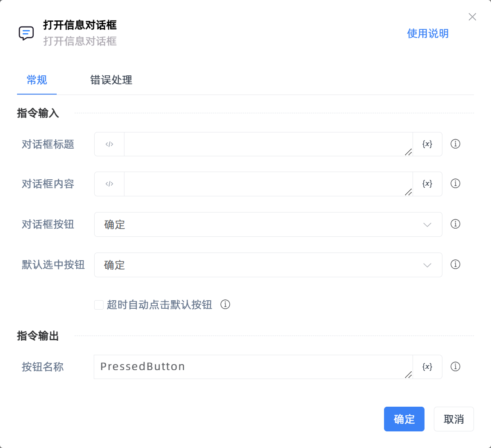

# 打开信息对话框
- 适用系统: windows / 信创

## 功能说明

:::tip 功能描述
打开一个信息对话框
:::

## 配置项说明

### 指令输入

- **标题**`string`: 
  - 请输入对话框的标题

- **内容**`string`: 
  - 请输入对话框的内容

- **按钮**`Integer`: 
  - 选择对话框按钮

- **默认选中的按钮**`Integer`: 
  - 请选择一个默认选中的按钮

- **超时自动点击默认按钮**`string`: 
  - 若对话框超过设定时间未点击按钮，则自动点击默认按钮

- **超时毫秒数**`Integer`: 
  - 在指定时间内若没有用户点击，则自动关闭对话框

### 指令输出

- **按钮名称**`string`: 
  - 指定一个变量名称，该变量用于保存指定按钮的名称

### 使用示例

- [点击下载查看示例](https://files.oss.krpalite.com:56780/%E5%BA%94%E7%94%A8/%E7%A4%BA%E4%BE%8B_%E6%89%93%E5%BC%80%E4%BF%A1%E6%81%AF%E5%AF%B9%E8%AF%9D%E6%A1%86.krpa) 
