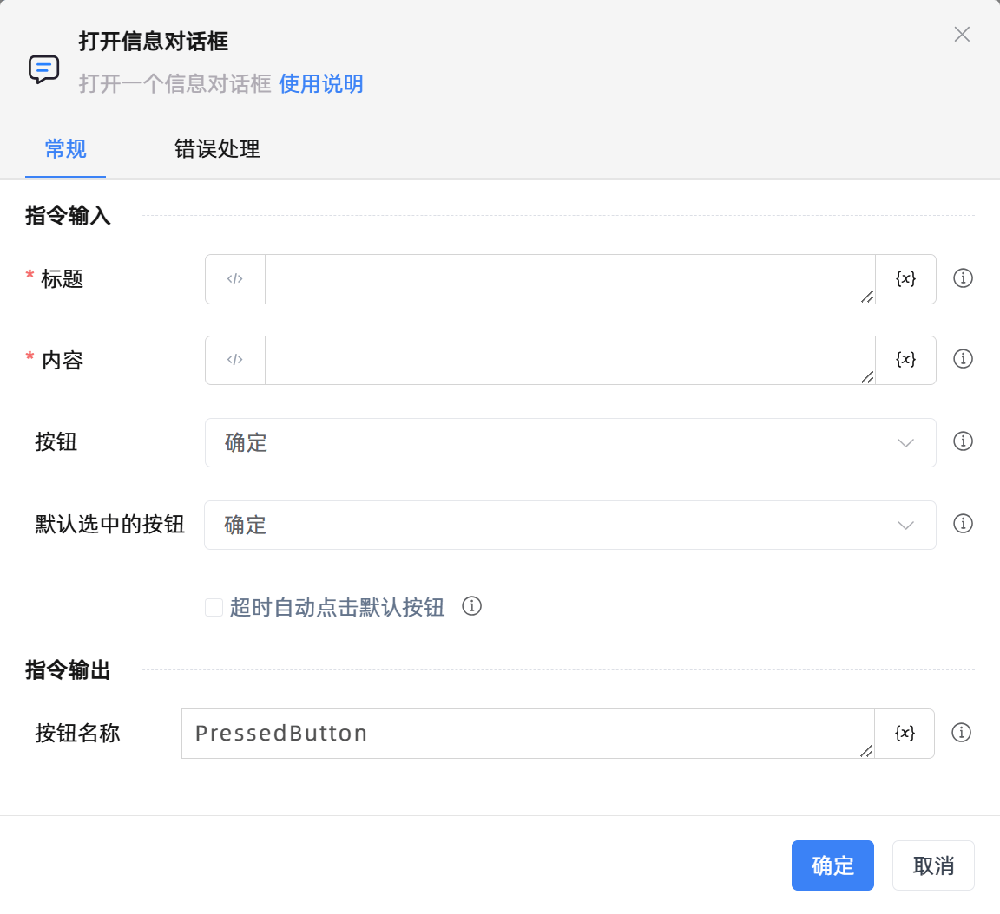

# 打开信息对话框

## 功能说明

:::tip 功能描述
打开一个信息对话框
:::

## 配置项说明

### 常规

**指令输入**

- **标题**`string`: 请输入对话框的标题

- **内容**`string`: 请输入对话框的内容

- **按钮**`Integer`: 选择对话框按钮

- **默认选中的按钮**`Integer`: 请选择一个默认选中的按钮

- **超时自动点击默认按钮**`Boolean`: 若对话框超过设定时间未点击按钮，则自动点击默认按钮

- **超时毫秒数**`Integer`: 在指定时间内若没有用户点击，则自动关闭对话框

**指令输出**

- **按钮名称**`string`: 指定一个变量名称，该变量用于保存指定按钮的名称

### 错误处理

- **打印错误日志**`Boolean`：当指令运行出错时，打印错误日志到【日志】面板。默认勾选。

- **处理方式**`Integer`：

    - **终止流程**：指令运行出错时，终止流程。

    - **忽略异常并继续执行**：指令运行出错时，忽略异常，继续执行流程。

    - **重试此指令**：指令运行出错时，重试运行指定次数指令，每次重试间隔指定时长。

## 使用示例
无

## 常见错误及处理

无

## 常见问题解答

无

